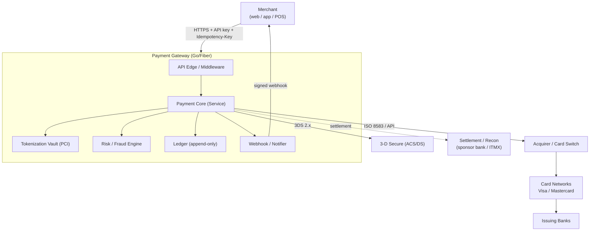
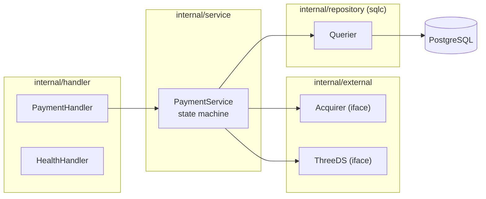
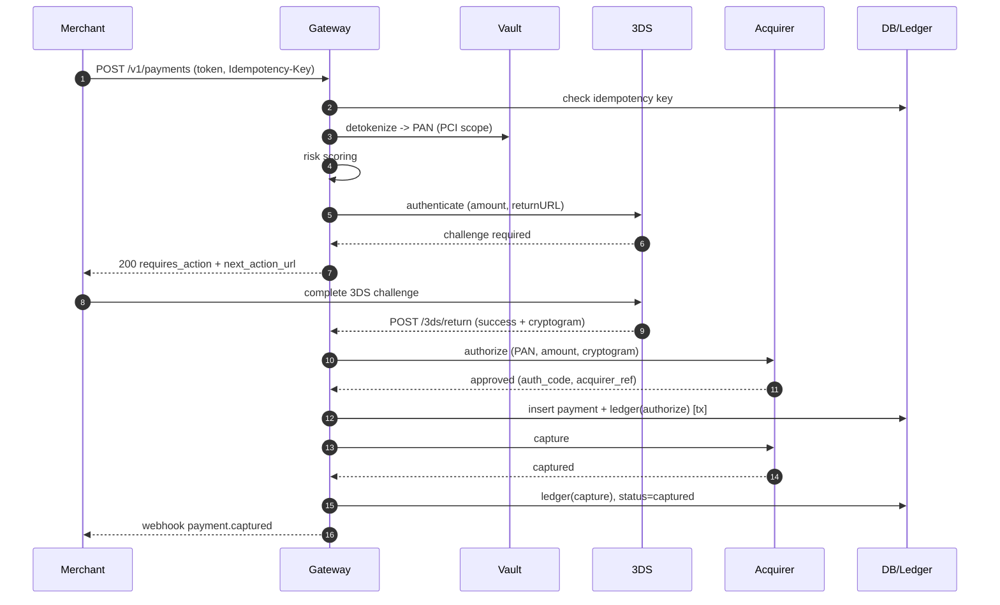
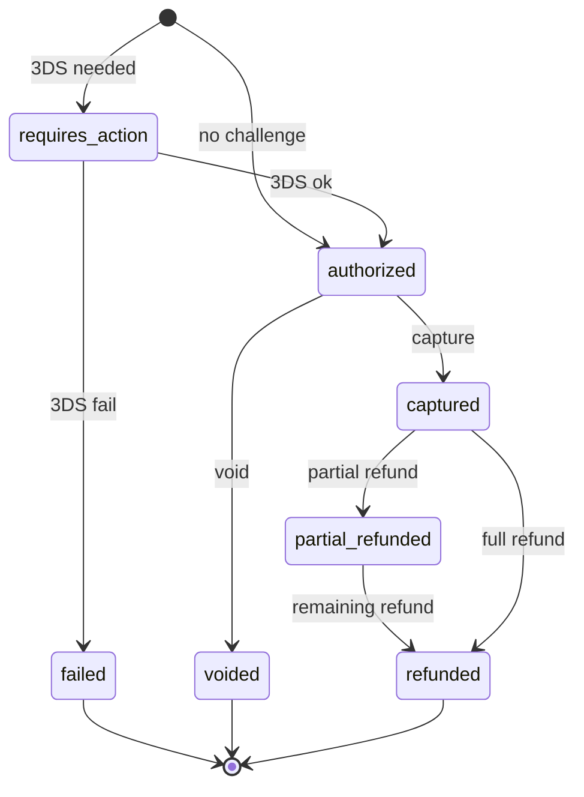
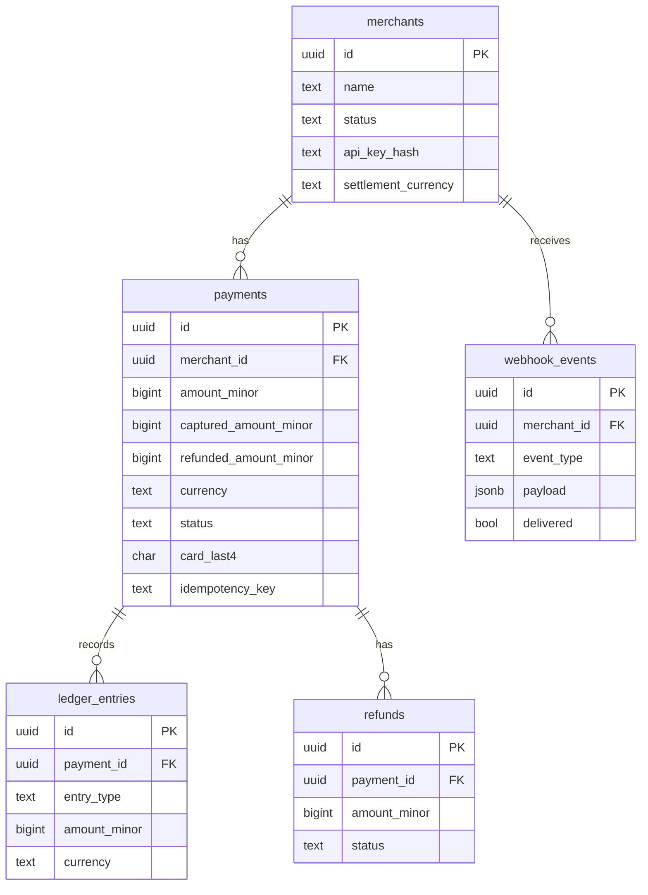

# Diagrams (Mermaid)

เปิดไฟล์นี้ในเครื่องมือที่ render mermaid ได้ (VS Code + Mermaid, GitHub, mermaid.live)

## 1. System Context

## 2. Component / Layers (Clean Architecture)

## 3. Sequence — Authorize + Capture (with 3DS)

## 4. Payment State Machine

## 5. Data Model (ERD)

