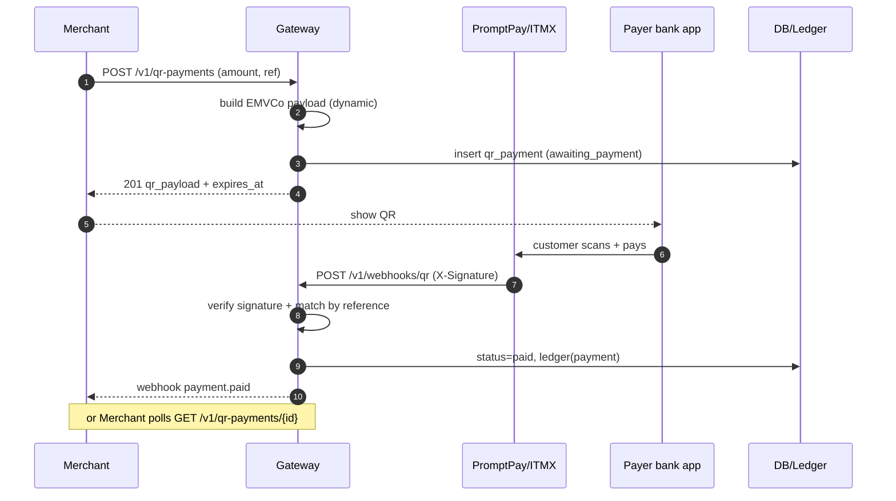

# QR Payment — การออกแบบ

รองรับ 4 ประเภท: **PromptPay Dynamic**, **PromptPay Static**, **Card-scheme QR**, **Cross-border QR**

---

## 1. ทำไม QR ต่างจากบัตร

การจ่ายด้วย QR เป็นแบบ **push / asynchronous** — ลูกค้าสแกนแล้ว "ผลัก" เงินจากแอปธนาคาร ระบบเราไม่ได้เป็นคนดึงเงิน จึง **ไม่มี authorize/capture** เหมือนบัตร แต่รอ **การยืนยันจากธนาคาร/PSP ผ่าน webhook** แล้วค่อยถือว่าจ่ายสำเร็จ

| | Card | QR |
|---|------|-----|
| โมเดล | pull (authorize→capture) | push (payer โอน, รอ confirm) |
| ยืนยันผล | ทันที (sync) | async ผ่าน webhook/polling |
| ข้อมูลบัตร | มี PAN (PCI scope) | ไม่มี card data |
| สถานะ | authorized/captured/... | awaiting_payment → paid/expired |

---

## 2. มาตรฐาน Thai QR / PromptPay

Thai QR Payment อ้างอิง **EMVCo QR Code Specification — Merchant Presented Mode (MPM)** กำกับโดย ธปท. และดำเนินการโดย **National ITMX**. Payload เป็น **TLV** (tag 2 หลัก + length 2 หลัก + value) ปิดท้ายด้วย **CRC-16/CCITT** ใน tag 63

- **Dynamic QR** (point of initiation `12`) — ฝังจำนวนเงิน (tag 54) + reference, ใช้ครั้งเดียว, กระทบยอดง่าย ← แนะนำสำหรับ e-commerce/POS
- **Static QR** (`11`) — ไม่ฝังจำนวนเงิน ลูกค้าใส่เอง, ใช้ซ้ำได้

โครงสร้าง tag สำคัญ (ดู `internal/pkg/promptpay/emv.go`):

| Tag | ความหมาย | ค่า |
|-----|----------|-----|
| 00 | Payload format | 01 |
| 01 | Point of initiation | 11 static / 12 dynamic |
| 29 | Merchant account (PromptPay) | AID `A000000677010111` + proxy (มือถือ/บัตร ปชช./e-wallet) |
| 53 | Currency | 764 (THB) |
| 54 | Amount | เฉพาะ dynamic |
| 58 | Country | TH |
| 62 | Additional data | reference (bill number) |
| 63 | CRC | CRC-16/CCITT |

> โค้ด `promptpay.Build()` สร้าง payload นี้ในระบบเราเองสำหรับ PromptPay ส่วน card-scheme/cross-border ให้ provider เป็นคน mint ผ่าน `external.QRProvider`

---

## 3. Flow (Dynamic QR)

1. Merchant → `POST /v1/qr-payments` `{method, amount, currency, reference}`
2. Gateway สร้าง EMV payload (PromptPay) หรือขอจาก provider (card/cross-border) → บันทึก `qr_payments` status `awaiting_payment` + `expires_at` → คืน `qr_payload` (เอาไป render เป็นภาพ QR) + เวลา
   - **correlation_ref**: minted ตอนสร้างเสมอ เป็น key ที่ webhook ขาเข้าใช้ match กลับมาที่ row
     - PromptPay: ฝัง reference นี้ไว้ใน EMVCo **tag 62** (bill/ref) ธนาคารจะ echo กลับมาใน webhook field `reference`
     - card/cross-border: ใช้ `provider_ref` ที่ PSP ออกให้เป็น correlation_ref
3. ลูกค้าสแกนด้วย mobile banking → โอนเงิน
4. ธนาคาร/PSP → `POST /v1/webhooks/qr` (มี `X-Signature`)
5. Gateway **verify signature** → correlate row (ลอง `provider_ref` ก่อน แล้ว fallback `correlation_ref` = webhook `reference`) → เช็ค idempotency (unique `correlation_ref` + สถานะ `paid`) → ตรวจ amount/currency → เปลี่ยนสถานะ `paid` + เขียน ledger
6. Merchant รู้ผลผ่าน **webhook** ที่เรายิงต่อ หรือ **polling** `GET /v1/qr-payments/{id}`
7. ถ้าเลย `expires_at` ยังไม่จ่าย → `expired`

---

## 4. Sequence Diagram

---

## 5. ข้อควรระวัง / ความปลอดภัย

- **Webhook signature** — ต้อง verify HMAC/signature ทุกครั้งก่อนเชื่อ body (`QRProvider.VerifyWebhook`)
- **Idempotency** — คุมด้วย unique `correlation_ref` (+ `provider_ref`) และ guard สถานะ `paid` (กัน confirm ซ้ำ / retry ของ PSP)
- **Correlation** — PromptPay สร้างในเครื่อง ไม่มี provider_ref จาก upstream จึงต้องฝัง correlation_ref ใน tag 62 ตอนสร้าง เพื่อให้ webhook match กลับได้ (เดิม PromptPay webhook correlate ไม่ได้)
- **Amount matching** — ตรวจยอดใน webhook ให้ตรงกับที่ออก QR (โดยเฉพาะ static ที่ลูกค้าใส่เอง)
- **Expiry & reconciliation** — job หมดอายุ QR + งานกระทบยอดปลายวันกับ statement ของธนาคาร/PSP
- **Underpayment/overpayment (static)** — กำหนดนโยบายจัดการเงินไม่ตรงยอด
- **Compliance** — QR/PromptPay อยู่ภายใต้ พ.ร.บ. ระบบการชำระเงิน เช่นกัน (ดู COMPLIANCE-TH.md); การเชื่อม PromptPay ต้องผ่านธนาคาร/ผู้ให้บริการที่เชื่อมกับ ITMX

---

## แหล่งอ้างอิง (Sources)

- [Thai QR Payment — Wikipedia](https://en.wikipedia.org/wiki/Thai_QR_Payment)
- [World Bank — Thailand PromptPay Case Study](https://fastpayments.worldbank.org/sites/default/files/2021-09/World_Bank_FPS_Thailand_PromptPay_Case_Study.pdf)
- [Guide to PromptPay in Thailand — Antom](https://knowledge.antom.com/guide-to-promptpay-in-thailand)
- [PromptPay QR (EMVCo) — dtinth/promptpay-qr](https://github.com/dtinth/promptpay-qr/blob/master/README.md)
