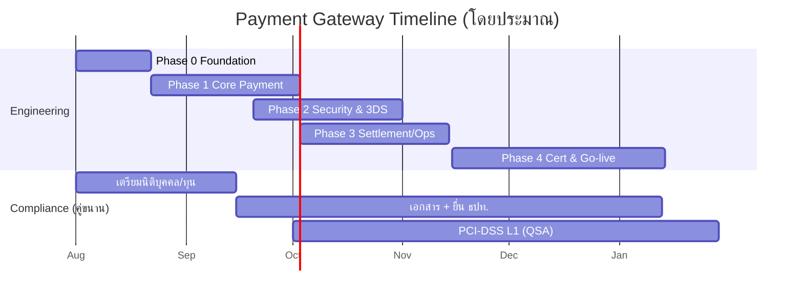

# Roadmap และประมาณการ

> ประมาณการเชิงกลยุทธ์เพื่อวางแผน ไม่ใช่ราคาผูกมัด ตัวเลขจริงขึ้นกับ scope, sponsor bank,
> ที่ปรึกษากฎหมาย และ QSA ที่เลือก

---

## 1. ภาพรวม 2 เส้นทาง

| | **เส้นทาง A: Payment Facilitating ก่อน** | **เส้นทาง B: Full Acquiring เต็มรูปแบบ** |
|---|---|---|
| ทุนจดทะเบียนขั้นต่ำ | 10 ล้านบาท | 50 ล้านบาท |
| ต่อ acquirer | ใช้ acquirer ที่มีอยู่ | ต้องมี sponsor bank + cert กับ scheme |
| PCI-DSS | SAQ → อาจถึง L1 | **L1 บังคับ** |
| เวลาเข้าตลาด | เร็วกว่า (~6-9 เดือน) | นานกว่า (~12-18 เดือน) |
| เหมาะกับ | เริ่มต้น พิสูจน์ตลาด | ปริมาณสูง คุมต้นทุนต่อรายการ |

**คำแนะนำ:** เริ่ม A แล้วยกระดับเป็น B — สถาปัตยกรรมชุดนี้รองรับทั้งคู่โดยไม่ต้องรื้อ

---

## 2. เฟสการพัฒนา (Engineering)

### Phase 0 — Foundation (สัปดาห์ 1-3)
Scaffold (ชุดนี้), CI/CD, DB migration, config/secret management, observability, dev/staging environment

### Phase 1 — Core Payment (สัปดาห์ 4-9)
authorize / capture / void / refund + state machine, idempotency, ledger, integration acquirer sandbox, unit/integration tests

### Phase 2 — Security & 3DS (สัปดาห์ 8-14)
tokenization vault + HSM/KMS, 3DS 2.x, network segmentation, WAF, secrets rotation, เตรียม PCI scope

### Phase 3 — Settlement & Ops (สัปดาห์ 13-18)
reconciliation worker, settlement/payout, webhook + retry + signature, merchant/admin API, dashboard, chargeback/dispute workflow

### Phase 4 — Certification & Go-live (สัปดาห์ 16-24+)
PCI-DSS audit (QSA→RoC), scheme certification, penetration test, load test, DR drill, production cutover

---

## 3. ทีมงานขั้นต่ำ (Core Team)

| บทบาท | จำนวน | หมายเหตุ |
|-------|------|---------|
| Backend (Go) | 3-4 | core payment, ledger, integration |
| Security / DevSecOps | 1-2 | PCI, HSM/KMS, network |
| SRE / Infra | 1-2 | HA, observability, DR |
| QA / Automation | 1-2 | integration + reconciliation testing |
| Product / PM | 1 | scope, roadmap, stakeholder |
| Compliance / Legal | 1 (+ ที่ปรึกษาภายนอก) | ใบอนุญาต, AML, PDPA |
| QSA (ภายนอก) | จ้าง | PCI audit |

---

## 4. ประมาณการต้นทุน (กรอบกว้าง, THB)

| รายการ | เส้นทาง A | เส้นทาง B |
|--------|----------|----------|
| ทุนจดทะเบียนชำระแล้ว (คงไว้ ≥75%) | 10 ล้าน | 50 ล้าน |
| ทีมพัฒนา (ปีแรก) | 8-15 ล้าน | 15-30 ล้าน |
| PCI-DSS (QSA, ASV, pentest, tooling) | 1-3 ล้าน/ปี | 3-6 ล้าน/ปี |
| HSM/KMS + infra (HA + DR) | 1-3 ล้าน/ปี | 3-8 ล้าน/ปี |
| ที่ปรึกษากฎหมาย/ใบอนุญาต | 0.5-2 ล้าน | 1-3 ล้าน |
| Sponsor bank / scheme cert | — | เจรจาเป็นราย |

> ทุนจดทะเบียนเป็นเงินที่ต้อง "มีและคงไว้" ไม่ใช่ค่าใช้จ่ายที่หายไป

---

## 5. Critical Path & ข้อควรระวัง

1. **ใบอนุญาต ธปท. + PCI L1 คือ critical path** — เริ่มคู่ขนานกับ engineering ตั้งแต่วันแรก
2. **Sponsor bank (เส้นทาง B)** — หา partner ให้ได้ก่อน เพราะกำหนดเวลา certification
3. อย่าเก็บ card data เองถ้ายังไม่จำเป็น — ลด PCI scope = ลดต้นทุน/เวลามหาศาล
4. Reconciliation & audit ต้องมีตั้งแต่ Phase 1 ไม่ใช่ค่อยเติมทีหลัง
5. ล็อกที่ปรึกษากฎหมาย + QSA ก่อน เพราะคิวและเวลาประเมินยาว

---

## 6. Next Actions (แนะนำ 5 ขั้นแรก)

1. ตัดสินใจ **เส้นทาง A หรือ B** และงบ/ทุนที่รับได้
2. ปรึกษาสำนักงานกฎหมายด้านใบอนุญาต ธปท. + ตรวจวัตถุประสงค์/ทุนบริษัท
3. คุย sponsor bank / acquirer partner (ทั้งสองเส้นทางต้องมี upstream)
4. เริ่ม Phase 0 จาก scaffold นี้ (ตั้ง CI/CD + staging)
5. เลือก QSA และวาง PCI scope/segmentation ตั้งแต่ออกแบบ network
