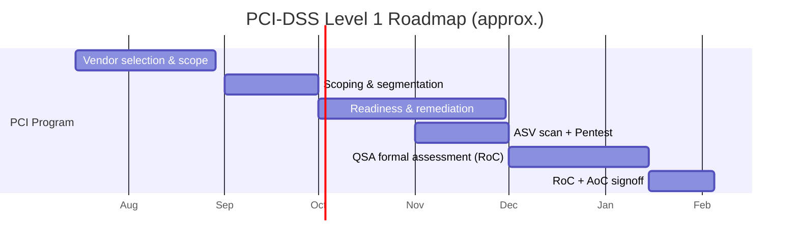

# แผนการปฏิบัติตาม PCI-DSS Level 1 (ไทย)

> เอกสารประกอบการยื่นขอใบอนุญาต **การให้บริการรับชำระเงินด้วยวิธีการทางอิเล็กทรอนิกส์ (Full Acquiring)**
> ภายใต้ พ.ร.บ. ระบบการชำระเงิน พ.ศ. 2560 ต่อธนาคารแห่งประเทศไทย (ธปท.) และเป็นแผนการได้มาซึ่งการรับรอง **PCI-DSS v4.0 Level 1**
>
> เอกสารเลขที่: `COMP-19` · เวอร์ชัน 1.0 · เจ้าของเอกสาร: Chief Information Security Officer (CISO) / PCI Program Lead
> เอกสารอ้างอิง: `COMPLIANCE-TH.md`, `ARCHITECTURE.md`, `ROADMAP.md`, `09-pdpa-privacy-policy.md`, `11-data-retention-deletion.md`
>
> **หมายเหตุ:** เอกสารนี้เป็นแผนงานและเอกสารเชิงนโยบายภายใน ไม่ใช่คำแนะนำทางกฎหมายหรือการรับรองการปฏิบัติตามมาตรฐาน สถานะการปฏิบัติตาม PCI-DSS ที่แท้จริงต้องได้รับการยืนยันโดย Qualified Security Assessor (QSA) ที่ขึ้นทะเบียนกับ PCI SSC เท่านั้น

---

> ### ⚠️ ข้อสมมติและสิ่งที่ยังต้องยืนยัน (Assumptions / TODO)
> รายการต่อไปนี้ยังขึ้นกับคู่สัญญา/ผู้ให้บริการภายนอกที่ยังไม่สรุป — **ห้ามถือเป็นข้อเท็จจริงจนกว่าจะยืนยัน**:
> - **[TODO — Sponsor Bank / Acquirer]** ยังไม่ลงนามธนาคารผู้รับเชื่อม (sponsoring bank) และ card scheme (Visa/Mastercard) — ผู้กำหนดว่าจะต้องยื่น **RoC + AoC** ประจำปีในฐานะใด (Level 1 service provider) และกำหนด acquirer-mandated deadline สำหรับ compliance validation
> - **[TODO — QSA vendor]** ยังไม่ลงนามผู้ประเมิน PCI-DSS (QSA firm) — ตัวอย่างผู้ให้บริการในไทย/ภูมิภาคที่อยู่ระหว่างพิจารณา ยังไม่ผูกมัด; ค่าธรรมเนียม, คิว และ scope walkthrough ต้องยืนยัน
> - **[TODO — ASV vendor]** ยังไม่เลือก Approved Scanning Vendor สำหรับ quarterly external scan (PCI Req 11.3.2)
> - **[TODO — Penetration test vendor]** ยังไม่เลือกผู้ทดสอบเจาะระบบภายนอก (annual pentest, PCI Req 11.4)
> - **[TODO — ทุนจดทะเบียน]** ทุนจดทะเบียนชำระแล้วเป้าหมาย **50 ล้านบาท** (Full Acquiring) — ต้องยืนยันจำนวนที่ชำระจริงและรักษาไว้ ≥ 75% ตลอดการดำเนินงาน (ดู `02-financial-projections-capital.md`)
> - **[TODO — HSM/KMS]** รุ่น/ผู้ให้บริการ HSM (on-prem PCI-PTS HSM หรือ cloud KMS ที่ผ่าน FIPS 140-2/140-3 Level 3) ยังไม่สรุป — กระทบ Req 3.5–3.7 (key management)
> - **[TODO — Cloud region / data residency]** ผู้ให้บริการ cloud และ region (ต้องเก็บข้อมูลในไทยตาม ธปท./PDPA) และสถานะ AoC ของ cloud provider ต้องยืนยัน (shared responsibility matrix)
> - **[TODO — ชื่อบริษัท/ที่อยู่/ผู้บริหาร]** ชื่อ `[บริษัท / Company]`, ที่อยู่จดทะเบียน, ชื่อ CISO/ISA ต้องเติมค่าจริงก่อนยื่น

---

## 1. บทนำ วัตถุประสงค์ และความสัมพันธ์กับใบอนุญาต ธปท.

`[บริษัท / Company]` (ต่อไปนี้เรียก "บริษัท") ประกอบธุรกิจให้บริการรับชำระเงินด้วยบัตร (Full Acquiring Payment Gateway) จึงเป็น **merchant-serving service provider** ที่ประมวลผล จัดเก็บ และ/หรือส่งผ่านข้อมูลผู้ถือบัตร (Cardholder Data — CHD) และต้องผ่านการรับรอง **PCI-DSS v4.0** ในระดับที่สูงที่สุด

เอกสารนี้เป็น **แผนงาน (roadmap)** ที่ครอบคลุม: การกำหนด scope, เส้นทางจากการประเมินตนเอง (SAQ) ไปสู่การประเมินเต็มรูปโดย QSA และออก Report on Compliance (RoC), การจ้าง QSA/ASV, ไทม์ไลน์ และหลักฐาน (evidence) ที่ต้องเตรียม

**ความสัมพันธ์กับใบอนุญาต ธปท.:** ตาม `COMPLIANCE-TH.md` §5 และ §6 การได้ **PCI-DSS Level 1** เป็นหนึ่งในหลักฐานที่ ธปท. คาดหวังสำหรับผู้ขอใบอนุญาต acquiring และเป็นงาน **คู่ขนาน (parallel critical path)** กับการยื่นใบอนุญาต ไม่ใช่งานลำดับหลัง PCI-DSS ยังหนุนหลักเกณฑ์ ธปท. ด้าน IT risk, cyber resilience และ outsourcing โดยตรง

### 1.1 ทำไมต้อง Level 1 (ไม่ใช่ระดับต่ำกว่า)
| ปัจจัย | เหตุผล |
|--------|--------|
| ปริมาณธุรกรรม | Level 1 service provider = ประมวลผล **> 6 ล้านรายการ/ปี** ต่อแบรนด์บัตร (Visa/Mastercard) หรือถูกกำหนดโดย acquirer/แบรนด์ |
| บทบาท service provider | ในฐานะ acquiring gateway ที่ให้บริการหลายร้านค้า card scheme มักกำหนดให้ validate ที่ Level 1 โดยไม่คำนึงปริมาณเริ่มต้น |
| ข้อกำหนดหลักฐาน | Level 1 บังคับ **on-site assessment โดย QSA → RoC + AoC** (ไม่ใช่ SAQ self-attest) + quarterly ASV scan |
| ความคาดหวัง ธปท. | สอดคล้อง ARCHITECTURE §7 ที่ระบุเป้าหมาย Level 1 ชัดเจน |

---

## 2. ขอบเขต (Scope) และ Cardholder Data Environment (CDE)

### 2.1 หลักการลด scope (Scope Minimization)
สอดคล้อง ARCHITECTURE §2, §6, §7 — บริษัทออกแบบให้ **นำ CHD ออกจาก scope ให้มากที่สุด**:

- **Client-side tokenization**: PAN ถูกส่งตรงจาก client (SDK/hosted field) ไปยัง Tokenization Vault ใน network segment ที่แยกออกอย่างชัดเจน โดย **ไม่ผ่านเซิร์ฟเวอร์ของร้านค้าและไม่ผ่านระบบหลัก (Payment Core)** ของบริษัท
- ระบบหลักและ operational DB เห็นเพียง **token + `card_last4` + `card_brand`** เท่านั้น
- **ห้ามจัดเก็บ Sensitive Authentication Data (SAD)** หลัง authorization โดยเด็ดขาด: CVV/CVV2/CVC2, PIN/PIN block, full magnetic-stripe/track data (PCI Req 3.3)

### 2.2 การนิยาม CDE และการแบ่งประเภทระบบ
| ประเภท | นิยาม (PCI-DSS v4.0) | ตัวอย่างในสถาปัตยกรรมนี้ |
|--------|----------------------|--------------------------|
| **CDE (in scope)** | ระบบที่ store/process/transmit CHD หรือ SAD | Tokenization Vault, HSM/KMS, Acquirer Adapter (ISO 8583/REST) ที่ส่ง PAN, 3DS Adapter ในส่วนที่แตะ PAN |
| **Connected-to / Security-impacting** | ระบบที่เชื่อมต่อหรือกระทบความปลอดภัย CDE | Payment Core (ผ่าน token), CI/CD ที่ deploy เข้า CDE, bastion/jump host, SIEM, IdP (SSO/MFA), NTP, DNS ภายใน |
| **Out of scope** | แยกจาก CDE ด้วย segmentation ที่ตรวจสอบได้ | Marketing site, merchant dashboard (อ่าน token), analytics ที่ไม่มี CHD |

> **หลักฐาน segmentation:** ต้องพิสูจน์ด้วย **segmentation penetration test** อย่างน้อยปีละครั้ง (Req 11.4.5 สำหรับ service provider) เพื่อยืนยันว่าระบบ out-of-scope แยกจาก CDE จริง

### 2.3 Data flow และ CHD inventory (สรุป)
| จุด | ข้อมูล | สถานะ scope | มาตรการ |
|-----|--------|-------------|---------|
| Client → Vault | PAN (single-use) | เข้า scope ที่ Vault | TLS 1.2+/1.3, tokenization ทันที |
| Vault at rest | PAN (ถ้าจำเป็น) | ใน CDE | envelope encryption, คีย์ใน HSM/KMS (Req 3.5–3.7) |
| Payment Core / operational DB | token, `card_last4`, `card_brand` | นอก CDE | ไม่มี PAN/SAD |
| Gateway → Acquirer | PAN (ระหว่าง authorize) | ใน CDE | mTLS, network segment แยก, ไม่ persist |
| Ledger / audit_log | จำนวนเงิน, สถานะ, `auth_code` | นอก CDE | append-only, ไม่มี CHD |

> **Data flow diagram (DFD)** ฉบับสมบูรณ์ต้องจัดทำและให้ QSA ทวนสอบ (อ้าง `DIAGRAMS.md`) — เป็นหลักฐานบังคับสำหรับ Req 1 และ scope validation

---

## 3. การจับคู่ 12 Requirements ของ PCI-DSS v4.0 กับสถาปัตยกรรม

| # | Requirement (v4.0) | การควบคุมหลักในระบบ | เอกสาร/ผู้รับผิดชอบ |
|---|--------------------|---------------------|---------------------|
| 1 | Network security controls (firewall/segmentation) | WAF, security groups, segmentation CDE, IDS/IPS, DFD | DevSecOps / SRE |
| 2 | Secure configurations | distroless image, hardening baseline (CIS), ไม่มี default password | DevSecOps |
| 3 | Protect stored account data | envelope encryption, HSM/KMS, key rotation, dual control, split knowledge; ห้ามเก็บ SAD | Security / CISO |
| 4 | Protect CHD in transit | TLS 1.2+/1.3, mTLS ภายใน, cert management | SRE |
| 5 | Anti-malware | EDR บน host ใน CDE, image scanning | DevSecOps |
| 6 | Secure software/systems | SAST/DAST, `govulncheck`, secure SDLC, change control, patch SLA | Engineering |
| 7 | Restrict access by need-to-know | RBAC, least privilege, access review รายไตรมาส | Security / HR |
| 8 | Identify & authenticate | MFA ทุกการเข้าถึง CDE และ admin (v4.0 เข้มขึ้น), password policy, no shared IDs | Security / IT |
| 9 | Physical access | ถ้าใช้ cloud → อ้าง AoC ของ provider; ถ้ามี HSM on-prem → ควบคุมทางกายภาพ | SRE / Facilities |
| 10 | Log & monitor | structured log ไม่มี CHD, ห้าม log request body ที่มี PAN, SIEM, time-sync (NTP), เก็บ log ≥ 12 เดือน (ออนไลน์ ≥ 3 เดือน) | SRE / SOC |
| 11 | Test security regularly | quarterly ASV scan, internal vuln scan, annual pentest (external+internal), segmentation test | Security / ASV / QSA |
| 12 | Security policy & program | ISMS, incident response, risk assessment, security awareness, TPSP management, targeted risk analysis (v4.0) | CISO / Compliance |

> **การเปลี่ยนแปลงสำคัญใน v4.0** ที่ต้องวางแผนล่วงหน้า: (ก) **client-side script integrity & HTTP header monitoring** (Req 6.4.3, 11.6.1) สำหรับ payment page/hosted fields, (ข) **MFA เข้มขึ้น** (Req 8.4/8.5), (ค) **targeted risk analysis** สำหรับความถี่ของ control หลายข้อ (Req 12.3.1), (ง) การปฏิบัติเป็น **customized approach** ต้องมีเอกสาร targeted risk analysis กำกับ

---

## 4. เส้นทาง SAQ → RoC (Validation Path)

### 4.1 บทบาทของ SAQ ในแผนนี้
บริษัทเป็น **Level 1 service provider** จึง **ต้อง validate ด้วย RoC เต็มรูป** ไม่สามารถ self-attest ด้วย SAQ ได้ในสถานะปลายทาง อย่างไรก็ตาม บริษัทใช้ **SAQ D (Service Provider)** เป็น **เครื่องมือ gap-assessment ภายใน (pre-audit readiness)** เพื่อประเมินความพร้อมก่อนจ้าง QSA — ไม่ใช่เอกสารยื่นสุดท้าย

| ขั้น | เอกสาร/ผลลัพธ์ | ผู้จัดทำ | ใช้ทำอะไร |
|------|----------------|---------|-----------|
| 1. Internal gap assessment | **SAQ D (Service Provider) worksheet** | PCI Program Lead + ISA (ถ้ามี) | หา gap ก่อน audit |
| 2. Remediation | gap remediation tracker | Engineering/Security | ปิด gap ทุกข้อ |
| 3. Formal assessment | **RoC (Report on Compliance)** | **QSA** | หลักฐานการปฏิบัติตามเต็มรูป |
| 4. Attestation | **AoC (Attestation of Compliance)** | QSA + ผู้บริหารบริษัท | ยื่นต่อ acquirer/scheme/ธปท. |
| 5. Continuous | quarterly ASV scan report, annual pentest report | ASV / pentest vendor | รักษาสถานะระหว่างปี |

### 4.2 เกณฑ์ผ่าน (Definition of Done)
- SAQ D ภายในผ่านทุก control (หรือมี compensating/customized control ที่มีเอกสารกำกับ)
- QSA ออก **RoC ที่มีผลลัพธ์ “In Place” ทุกข้อ** และ **AoC ที่ลงนาม**
- Quarterly ASV scan ล่าสุดผ่าน (no failing/high vulnerabilities)
- Pentest ล่าสุดปิด finding ระดับ high/critical แล้ว

---

## 5. การจ้าง QSA และ ASV (Vendor Engagement)

### 5.1 เกณฑ์คัดเลือก QSA
- ขึ้นทะเบียนกับ **PCI SSC** และมีสิทธิประเมิน v4.0
- มีประสบการณ์กับ **acquirer/gateway ในไทย/อาเซียน** และเข้าใจข้อกำหนด ธปท. (data residency)
- ให้บริการ **scoping workshop + readiness (pre-assessment)** ก่อน formal RoC
- คิวและระยะเวลาสอดคล้องกับไทม์ไลน์ (§6)

### 5.2 ขั้นตอนการทำงานร่วม QSA
1. **Scoping workshop** — ยืนยัน CDE, DFD, asset inventory, segmentation
2. **Readiness / gap assessment** — QSA ทวน SAQ D ภายใน + สุ่มหลักฐาน
3. **Remediation window** — ปิด gap (ควรกันเวลา ≥ 4–8 สัปดาห์)
4. **Formal assessment (on-site + evidence review)** — สัมภาษณ์, สังเกตการณ์, ทวน config/log/policy
5. **RoC drafting + QA** — QSA ร่าง RoC, บริษัทตอบข้อสังเกต
6. **AoC signing** — ลงนามและส่งให้ acquirer/scheme/ธปท.

### 5.3 ASV และ Penetration Test
| งาน | ความถี่ | ผู้ทำ | ข้อกำหนด |
|------|---------|-------|-----------|
| External vulnerability scan | **รายไตรมาส** + หลัง significant change | **ASV** (ขึ้นทะเบียน PCI SSC) | Req 11.3.2 — ต้อง pass |
| Internal vulnerability scan | รายไตรมาส + หลัง change | ทีมภายใน/เครื่องมือ | Req 11.3.1 |
| Penetration test (external + internal) | **รายปี** + หลัง significant change | pentest vendor อิสระ | Req 11.4 |
| Segmentation test | **รายปี** (service provider ทุก 6 เดือน หากใช้ segmentation เป็นการลด scope — Req 11.4.5/11.4.6) | pentest vendor | ยืนยัน isolation ของ CDE |

> **[TODO]** ยืนยันความถี่ segmentation test: service provider ที่พึ่งพา segmentation ต้องทดสอบ **ทุก 6 เดือน** (Req 11.4.6)

---

## 6. ไทม์ไลน์ (Timeline)

สอดคล้องกับ `ROADMAP.md` — PCI-DSS L1 (QSA) เริ่ม **2026-10-01** ระยะเวลาราว 120 วัน คู่ขนานกับ Phase 2–4 ของ engineering

| ช่วง | เดือน (โดยประมาณ) | กิจกรรม PCI | ผลลัพธ์ |
|------|-------------------|-------------|---------|
| M0 | ก.ค.–ส.ค. 2026 | เลือก QSA/ASV/pentest vendor, กำหนด scope เบื้องต้น, เริ่ม SAQ D ภายใน | vendor shortlist, draft scope |
| M1 | ก.ย. 2026 | Scoping workshop, จัดทำ DFD/asset inventory, network segmentation, HSM/KMS setup | scope baseline, segmentation |
| M2–M3 | ต.ค.–พ.ย. 2026 | QSA readiness/gap assessment, remediation, ตั้ง SIEM/log, MFA, policy suite | gap closed, evidence pack v1 |
| M3 | พ.ย. 2026 | Quarterly ASV scan รอบแรก (pass), pentest + segmentation test | scan pass, pentest report |
| M4 | ธ.ค. 2026–ม.ค. 2027 | QSA formal on-site assessment, evidence review | RoC draft |
| M4–M5 | ม.ค. 2027 | RoC finalize + AoC signing | **RoC + AoC** |
| ต่อเนื่อง | ทุกไตรมาส/ทุกปี | ASV scan รายไตรมาส, annual pentest, RoC ต่ออายุ | รักษาสถานะ L1 |

---

## 7. หลักฐาน (Evidence) ที่ต้องเตรียมสำหรับ RoC

| หมวด (Req) | หลักฐาน | ที่มา/ระบบ |
|------------|---------|------------|
| Scope (1, 12) | DFD, asset/CHD inventory, network diagram, segmentation test report | `DIAGRAMS.md`, SRE |
| Req 3 | key management policy, HSM/KMS config, key rotation log, dual control record | Security |
| Req 4 | TLS config, cert inventory, mTLS proof | SRE |
| Req 6 | secure SDLC policy, SAST/DAST/`govulncheck` reports, change tickets, patch SLA log | Engineering |
| Req 6.4.3/11.6.1 | script inventory & integrity, HTTP header/tamper monitoring บน payment page | Frontend/Security |
| Req 7–8 | RBAC matrix, access review records (รายไตรมาส), MFA config, joiner/mover/leaver log | Security/HR |
| Req 10 | SIEM config, log retention proof (≥12 เดือน), NTP config, log review evidence | SOC/SRE |
| Req 11 | ASV scan reports (4 ไตรมาส), pentest report, segmentation test | ASV/pentest vendor |
| Req 12 | ISMS/policy suite, incident response plan + test, risk assessment, security awareness records, **TPSP register + AoC ของผู้ให้บริการ** | Compliance/CISO |

> **หลักการเก็บหลักฐาน:** จัดเก็บใน **evidence repository** ที่ควบคุมสิทธิ์ มี version + timestamp + owner; หลักฐานที่มี CHD ห้ามนำออกจาก CDE — ใช้ redaction; สอดคล้อง `11-data-retention-deletion.md`

---

## 8. การกำกับ ความสัมพันธ์กับกฎหมายไทย และการรักษาสถานะ

### 8.1 บทบาทและความรับผิดชอบ (RACI ระดับสรุป)
| บทบาท | ความรับผิดชอบหลัก |
|-------|-------------------|
| **CISO / PCI Program Lead** | เจ้าของโปรแกรม PCI, ตัดสิน scope, ลงนาม AoC ร่วมผู้บริหาร |
| **DevSecOps / SRE** | segmentation, firewall, hardening, TLS, logging, scan |
| **Engineering Lead** | secure SDLC, remediation ระดับแอป, change control |
| **Compliance / Legal** | เชื่อมกับใบอนุญาต ธปท., PDPA, AML, จัดการสัญญา QSA/TPSP |
| **QSA (ภายนอก)** | ประเมินและออก RoC/AoC |
| **ASV / Pentest (ภายนอก)** | scan รายไตรมาส / pentest รายปี |

### 8.2 ความเชื่อมโยงกับหน่วยงานกำกับไทย
- **ธปท.** — PCI L1 (RoC/AoC) เป็นหลักฐานประกอบใบอนุญาต acquiring และหนุนหลักเกณฑ์ IT risk/cyber resilience/outsourcing; ต้องพร้อมให้ตรวจ on-site
- **PDPC (PDPA)** — การจัดการ CHD สอดคล้อง `09-pdpa-privacy-policy.md`; PCI segmentation/encryption เป็นมาตรการเชิงเทคนิคตามมาตรา 37
- **ปปง./AMLO** — audit log และ transaction record ที่ PCI Req 10 กำหนด หนุนหลักฐาน AML/CDD และการเก็บรักษาเอกสาร

### 8.3 การรักษาสถานะระหว่างปี (BAU)
- **รายไตรมาส:** ASV scan (pass), access review, internal vuln scan
- **รายปี:** RoC/AoC renewal, penetration test, segmentation test, risk assessment, incident response test, security awareness
- **เมื่อมี significant change:** re-scope, re-scan, ประเมินผลกระทบต่อ CDE ก่อน deploy
- **TPSP management:** เก็บ AoC ของผู้ให้บริการภายนอก (cloud, 3DS, HSM/KMS) และทบทวนรายปี (Req 12.8)

---

# PCI-DSS Level 1 compliance roadmap: scope, SAQ->RoC, QSA engagement, timeline, evidence (English)

> Supporting document for the license application for **Electronic Payment Acquiring Service (Full Acquiring)**
> under the Payment Systems Act B.E. 2560 (2017), submitted to the Bank of Thailand (BOT / ธปท.), and the roadmap to achieve **PCI-DSS v4.0 Level 1** certification.
>
> Document No.: `COMP-19` · Version 1.0 · Owner: Chief Information Security Officer (CISO) / PCI Program Lead
> Related documents: `COMPLIANCE-TH.md`, `ARCHITECTURE.md`, `ROADMAP.md`, `09-pdpa-privacy-policy.md`, `11-data-retention-deletion.md`
>
> **Note:** This is a roadmap and internal policy document, not legal advice or a certification of compliance. Actual PCI-DSS compliance status can only be confirmed by a Qualified Security Assessor (QSA) registered with the PCI SSC.

---

> ### ⚠️ Assumptions / TODO
> The following depend on unresolved external parties — **do not treat as fact until confirmed**:
> - **[TODO — Sponsor Bank / Acquirer]** No sponsoring bank / card scheme (Visa/Mastercard) contract signed yet — this determines the Level 1 service-provider validation obligation (annual RoC + AoC) and the acquirer-mandated compliance deadline.
> - **[TODO — QSA vendor]** QSA firm not yet engaged — candidate Thai/regional assessors under consideration but not committed; fees, lead time, and scope walkthrough to be confirmed.
> - **[TODO — ASV vendor]** Approved Scanning Vendor for quarterly external scans (Req 11.3.2) not yet selected.
> - **[TODO — Penetration test vendor]** Independent annual penetration test vendor (Req 11.4) not yet selected.
> - **[TODO — Paid-up capital]** Target paid-up capital **THB 50M** (Full Acquiring) — actual paid amount and ≥ 75% maintenance must be confirmed (see `02-financial-projections-capital.md`).
> - **[TODO — HSM/KMS]** HSM model / provider (on-prem PCI-PTS HSM or cloud KMS validated to FIPS 140-2/140-3 Level 3) not finalized — affects Req 3.5–3.7 (key management).
> - **[TODO — Cloud region / data residency]** Cloud provider and region (data must reside in Thailand per BOT/PDPA) and the provider's AoC status to be confirmed (shared responsibility matrix).
> - **[TODO — Company details]** `[บริษัท / Company]` legal name, registered address, and named CISO/ISA to be filled before submission.

---

## 1. Introduction, purpose, and relationship to the BOT license

`[บริษัท / Company]` (the "Company") operates a Full Acquiring Payment Gateway and is therefore a **merchant-serving service provider** that processes, stores, and/or transmits Cardholder Data (CHD) and must be validated to the highest **PCI-DSS v4.0** level.

This document is the **roadmap** covering: scope definition, the path from self-assessment (SAQ) to a full QSA-led assessment producing a Report on Compliance (RoC), QSA/ASV engagement, the timeline, and the evidence to be assembled.

**Relationship to the BOT license:** per `COMPLIANCE-TH.md` §5 and §6, achieving **PCI-DSS Level 1** is one of the evidence items the BOT expects from an acquiring-license applicant and runs on a **parallel critical path** with the license filing — not afterward. PCI-DSS also directly supports the BOT's IT-risk, cyber-resilience, and outsourcing requirements.

### 1.1 Why Level 1 (not a lower tier)
| Factor | Rationale |
|--------|-----------|
| Transaction volume | Level 1 service provider = **> 6M transactions/year** per card brand (Visa/Mastercard), or designated by acquirer/brand |
| Service-provider role | As a multi-merchant acquiring gateway, schemes typically require Level 1 validation regardless of initial volume |
| Evidence requirement | Level 1 mandates an **on-site QSA assessment → RoC + AoC** (not a self-attested SAQ) + quarterly ASV scans |
| BOT expectation | Consistent with ARCHITECTURE §7, which explicitly targets Level 1 |

---

## 2. Scope and the Cardholder Data Environment (CDE)

### 2.1 Scope minimization principle
Consistent with ARCHITECTURE §2, §6, §7 — the Company keeps **CHD out of scope as much as possible**:

- **Client-side tokenization**: the PAN is sent directly from the client (SDK/hosted field) to the Tokenization Vault in a clearly isolated network segment, **bypassing both the merchant's servers and the Company's core system (Payment Core)**.
- The core system and operational DB only ever see **token + `card_last4` + `card_brand`**.
- **Sensitive Authentication Data (SAD) is never stored** after authorization: CVV/CVV2/CVC2, PIN/PIN block, full magnetic-stripe/track data (Req 3.3).

### 2.2 Defining the CDE and classifying systems
| Category | Definition (PCI-DSS v4.0) | Example in this architecture |
|----------|---------------------------|------------------------------|
| **CDE (in scope)** | Systems that store/process/transmit CHD or SAD | Tokenization Vault, HSM/KMS, Acquirer Adapter (ISO 8583/REST) transmitting PAN, 3DS Adapter where it touches PAN |
| **Connected-to / Security-impacting** | Systems connected to or impacting CDE security | Payment Core (via token), CI/CD deploying into the CDE, bastion/jump host, SIEM, IdP (SSO/MFA), NTP, internal DNS |
| **Out of scope** | Isolated from the CDE by verifiable segmentation | Marketing site, merchant dashboard (reads token), analytics with no CHD |

> **Segmentation evidence:** must be proven by a **segmentation penetration test** at least annually (Req 11.4.5, and every 6 months for service providers per 11.4.6) to confirm out-of-scope systems are truly isolated from the CDE.

### 2.3 Data flow and CHD inventory (summary)
| Point | Data | Scope status | Control |
|-------|------|--------------|---------|
| Client → Vault | PAN (single-use) | Enters scope at Vault | TLS 1.2+/1.3, immediate tokenization |
| Vault at rest | PAN (if retained) | In CDE | Envelope encryption, keys in HSM/KMS (Req 3.5–3.7) |
| Payment Core / operational DB | token, `card_last4`, `card_brand` | Out of CDE | No PAN/SAD |
| Gateway → Acquirer | PAN (during authorize) | In CDE | mTLS, isolated segment, not persisted |
| Ledger / audit_log | amount, status, `auth_code` | Out of CDE | Append-only, no CHD |

> A complete **Data Flow Diagram (DFD)** must be produced and reviewed by the QSA (see `DIAGRAMS.md`) — mandatory evidence for Req 1 and scope validation.

---

## 3. Mapping the 12 PCI-DSS v4.0 requirements to the architecture

| # | Requirement (v4.0) | Primary controls | Doc/owner |
|---|--------------------|------------------|-----------|
| 1 | Network security controls | WAF, security groups, CDE segmentation, IDS/IPS, DFD | DevSecOps / SRE |
| 2 | Secure configurations | Distroless images, CIS hardening baseline, no default passwords | DevSecOps |
| 3 | Protect stored account data | Envelope encryption, HSM/KMS, key rotation, dual control, split knowledge; no SAD stored | Security / CISO |
| 4 | Protect CHD in transit | TLS 1.2+/1.3, internal mTLS, certificate management | SRE |
| 5 | Anti-malware | EDR on CDE hosts, image scanning | DevSecOps |
| 6 | Secure software/systems | SAST/DAST, `govulncheck`, secure SDLC, change control, patch SLA | Engineering |
| 6.4.3 / 11.6.1 | Payment-page script integrity & tamper monitoring | Script inventory + integrity, HTTP header/change monitoring | Frontend/Security |
| 7 | Restrict access by need-to-know | RBAC, least privilege, quarterly access review | Security / HR |
| 8 | Identify & authenticate | MFA for all CDE and admin access (stricter in v4.0), password policy, no shared IDs | Security / IT |
| 9 | Physical access | If cloud → rely on provider AoC; if on-prem HSM → physical controls | SRE / Facilities |
| 10 | Log & monitor | Structured logs with no CHD, no request-body logging of PAN, SIEM, NTP time-sync, retain logs ≥ 12 months (≥ 3 online) | SRE / SOC |
| 11 | Test security regularly | Quarterly ASV scan, internal vuln scan, annual pentest (external+internal), segmentation test | Security / ASV / QSA |
| 12 | Security policy & program | ISMS, incident response, risk assessment, security awareness, TPSP management, targeted risk analysis (v4.0) | CISO / Compliance |

> **Key v4.0 changes to plan ahead for:** (a) **client-side script integrity & HTTP header monitoring** (Req 6.4.3, 11.6.1) for payment pages/hosted fields; (b) **stronger MFA** (Req 8.4/8.5); (c) **targeted risk analysis** governing the frequency of several controls (Req 12.3.1); (d) any **customized approach** must be documented with a targeted risk analysis.

---

## 4. SAQ → RoC validation path

### 4.1 Role of the SAQ in this plan
The Company is a **Level 1 service provider** and therefore **must validate with a full RoC** at its end state — it cannot self-attest with a SAQ. However, the Company uses the **SAQ D (Service Provider)** as an **internal pre-audit gap-assessment tool** to gauge readiness before engaging the QSA — not as the final submission artifact.

| Step | Artifact/output | Prepared by | Purpose |
|------|-----------------|-------------|---------|
| 1. Internal gap assessment | **SAQ D (Service Provider) worksheet** | PCI Program Lead + ISA (if any) | Find gaps before audit |
| 2. Remediation | Gap remediation tracker | Engineering/Security | Close all gaps |
| 3. Formal assessment | **RoC (Report on Compliance)** | **QSA** | Full compliance evidence |
| 4. Attestation | **AoC (Attestation of Compliance)** | QSA + Company executive | Submit to acquirer/scheme/BOT |
| 5. Continuous | Quarterly ASV scan report, annual pentest report | ASV / pentest vendor | Maintain status in-year |

### 4.2 Definition of Done
- Internal SAQ D passes on every control (or has documented compensating/customized controls).
- The QSA issues a **RoC marked "In Place" on every requirement** and a **signed AoC**.
- The latest quarterly ASV scan passes (no failing/high vulnerabilities).
- The latest pentest has all high/critical findings remediated.

---

## 5. QSA and ASV engagement

### 5.1 QSA selection criteria
- Registered with the **PCI SSC** and authorized to assess v4.0.
- Experience with **acquirers/gateways in Thailand/ASEAN** and understanding of BOT requirements (data residency).
- Provides a **scoping workshop + readiness (pre-assessment)** before the formal RoC.
- Availability and lead time compatible with the timeline (§6).

### 5.2 QSA engagement steps
1. **Scoping workshop** — confirm CDE, DFD, asset inventory, segmentation.
2. **Readiness / gap assessment** — QSA reviews the internal SAQ D and samples evidence.
3. **Remediation window** — close gaps (reserve ≥ 4–8 weeks).
4. **Formal assessment (on-site + evidence review)** — interviews, observation, review of config/logs/policy.
5. **RoC drafting + QA** — QSA drafts the RoC; the Company responds to observations.
6. **AoC signing** — sign and submit to acquirer/scheme/BOT.

### 5.3 ASV and penetration testing
| Task | Frequency | Performed by | Requirement |
|------|-----------|--------------|-------------|
| External vulnerability scan | **Quarterly** + after significant change | **ASV** (PCI SSC registered) | Req 11.3.2 — must pass |
| Internal vulnerability scan | Quarterly + after change | Internal team/tooling | Req 11.3.1 |
| Penetration test (external + internal) | **Annual** + after significant change | Independent pentest vendor | Req 11.4 |
| Segmentation test | Service providers using segmentation to reduce scope: **every 6 months** | Pentest vendor | Req 11.4.6 — confirm CDE isolation |

---

## 6. Timeline

Consistent with `ROADMAP.md` — PCI-DSS L1 (QSA) starts **2026-10-01**, roughly 120 days, in parallel with engineering Phases 2–4.

| Window | Month (approx.) | PCI activity | Output |
|--------|-----------------|--------------|--------|
| M0 | Jul–Aug 2026 | Select QSA/ASV/pentest vendors, draft scope, start internal SAQ D | Vendor shortlist, draft scope |
| M1 | Sep 2026 | Scoping workshop, produce DFD/asset inventory, network segmentation, HSM/KMS setup | Scope baseline, segmentation |
| M2–M3 | Oct–Nov 2026 | QSA readiness/gap assessment, remediation, SIEM/logging, MFA, policy suite | Gaps closed, evidence pack v1 |
| M3 | Nov 2026 | First quarterly ASV scan (pass), pentest + segmentation test | Scan pass, pentest report |
| M4 | Dec 2026–Jan 2027 | QSA formal on-site assessment, evidence review | RoC draft |
| M4–M5 | Jan 2027 | RoC finalize + AoC signing | **RoC + AoC** |
| Ongoing | Quarterly/annual | Quarterly ASV scans, annual pentest, RoC renewal | Maintain L1 status |

---

## 7. Evidence to assemble for the RoC

| Category (Req) | Evidence | Source/system |
|----------------|----------|---------------|
| Scope (1, 12) | DFD, asset/CHD inventory, network diagram, segmentation test report | `DIAGRAMS.md`, SRE |
| Req 3 | Key management policy, HSM/KMS config, key rotation log, dual-control record | Security |
| Req 4 | TLS config, certificate inventory, mTLS proof | SRE |
| Req 6 | Secure SDLC policy, SAST/DAST/`govulncheck` reports, change tickets, patch SLA log | Engineering |
| Req 6.4.3/11.6.1 | Script inventory & integrity, HTTP header/tamper monitoring on payment page | Frontend/Security |
| Req 7–8 | RBAC matrix, quarterly access review records, MFA config, joiner/mover/leaver log | Security/HR |
| Req 10 | SIEM config, log retention proof (≥12 months), NTP config, log review evidence | SOC/SRE |
| Req 11 | ASV scan reports (4 quarters), pentest report, segmentation test | ASV/pentest vendor |
| Req 12 | ISMS/policy suite, incident response plan + test, risk assessment, security awareness records, **TPSP register + provider AoCs** | Compliance/CISO |

> **Evidence handling principle:** store in an access-controlled **evidence repository** with version + timestamp + owner; evidence containing CHD must not leave the CDE — use redaction; consistent with `11-data-retention-deletion.md`.

---

## 8. Governance, Thai regulatory linkage, and maintaining status

### 8.1 Roles and responsibilities (summary RACI)
| Role | Primary responsibility |
|------|------------------------|
| **CISO / PCI Program Lead** | Owns the PCI program, decides scope, co-signs the AoC |
| **DevSecOps / SRE** | Segmentation, firewall, hardening, TLS, logging, scanning |
| **Engineering Lead** | Secure SDLC, app-level remediation, change control |
| **Compliance / Legal** | Links to the BOT license, PDPA, AML; manages QSA/TPSP contracts |
| **QSA (external)** | Assesses and issues RoC/AoC |
| **ASV / Pentest (external)** | Quarterly scans / annual pentest |

### 8.2 Linkage to Thai regulators
- **BOT (ธปท.)** — PCI L1 (RoC/AoC) is evidence supporting the acquiring license and the IT-risk/cyber-resilience/outsourcing requirements; must be ready for on-site inspection.
- **PDPC (PDPA)** — CHD handling aligns with `09-pdpa-privacy-policy.md`; PCI segmentation/encryption are the technical measures under Section 37.
- **AMLO (ปปง.)** — the audit logs and transaction records required by PCI Req 10 support AML/CDD evidence and record retention.

### 8.3 Business-as-usual (maintaining status in-year)
- **Quarterly:** ASV scan (pass), access review, internal vuln scan.
- **Annually:** RoC/AoC renewal, penetration test, segmentation test, risk assessment, incident response test, security awareness.
- **On significant change:** re-scope, re-scan, assess CDE impact before deploy.
- **TPSP management:** retain external providers' AoCs (cloud, 3DS, HSM/KMS) and review annually (Req 12.8).

---

> **Standards referenced:** PCI-DSS v4.0 (PCI SSC), EMV 3-D Secure (EMV 3DS) 2.x, ISO 8583, FIPS 140-2/140-3.
> **Thai regulations referenced:** พ.ร.บ. ระบบการชำระเงิน พ.ศ. 2560 (BOT/ธปท.), PDPA พ.ศ. 2562 (PDPC), พ.ร.บ. ปปง./AMLO.
> This roadmap must be reviewed by legal counsel and the engaged QSA before submission.
