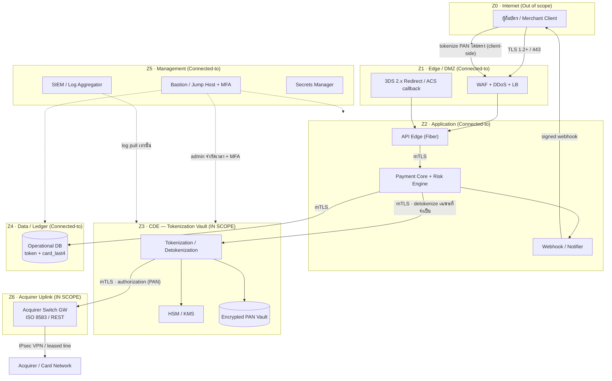
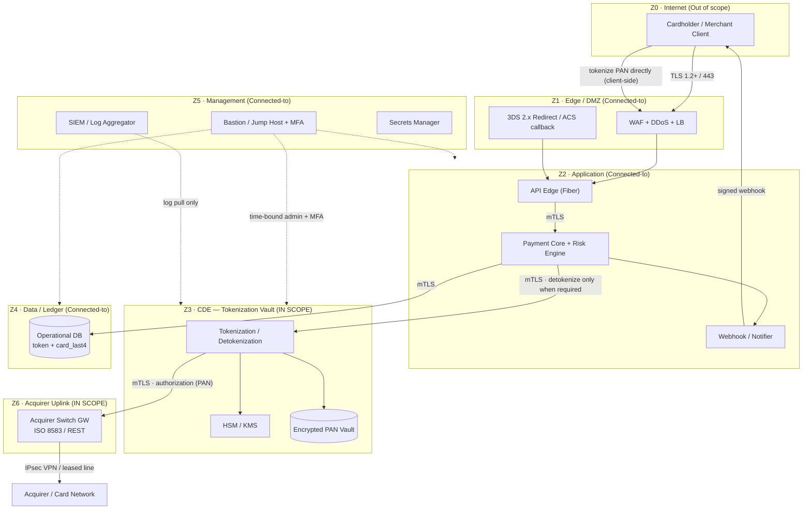

# แผนภาพการแบ่งเครือข่ายและขอบเขต CDE (ไทย)

> เอกสารประกอบการยื่นขอใบอนุญาต **การให้บริการรับชำระเงินด้วยวิธีการทางอิเล็กทรอนิกส์ (Full Acquiring)**
> ภายใต้ พ.ร.บ. ระบบการชำระเงิน พ.ศ. 2560 ต่อธนาคารแห่งประเทศไทย (ธปท.) และเป็นเอกสารประกอบการประเมิน PCI-DSS v4.0 Level 1 (Requirement 1)
>
> เอกสารเลขที่: `COMP-20` · เวอร์ชัน 1.0 · เจ้าของเอกสาร: Chief Information Security Officer (CISO) / DevSecOps
> เอกสารอ้างอิง: `COMPLIANCE-TH.md`, `ARCHITECTURE.md`, `ROADMAP.md`, `docs/compliance/09-pdpa-privacy-policy.md`
>
> **หมายเหตุ:** เอกสารนี้เป็นเอกสารเชิงเทคนิค/นโยบายภายใน ไม่ใช่คำแนะนำทางกฎหมาย ต้องผ่านการทบทวนโดยที่ปรึกษากฎหมายและ QSA ก่อนยื่นจริง

---

> ### ⚠️ ข้อสมมติและสิ่งที่ยังต้องยืนยัน (Assumptions / TODO)
> รายการต่อไปนี้ยังขึ้นกับคู่สัญญา/ผู้ให้บริการภายนอกที่ยังไม่สรุป — ห้ามถือเป็นข้อเท็จจริงจนกว่าจะยืนยัน:
> - **[TODO — Sponsor Bank / Acquirer]** ยังไม่ลงนามธนาคารผู้รับเชื่อม (sponsoring bank) และ card scheme (Visa/Mastercard) — วิธีเชื่อมต่อ (leased line / MPLS / IPsec VPN ไป acquirer switch), ช่วง IP และพอร์ต ISO 8583 จะกำหนดได้หลังลงนาม
> - **[TODO — QSA / ASV]** ยังไม่เลือกผู้ประเมิน PCI-DSS (Qualified Security Assessor) และผู้ให้บริการ ASV — ขอบเขต CDE, การนิยาม segmentation และผลการทดสอบ penetration test เพื่อยืนยันการแยกส่วน (PCI Req 11.4.5) ต้องผ่านการรับรองโดย QSA
> - **[TODO — Cloud / Data Residency]** ผู้ให้บริการ cloud และ region ยังไม่สรุป — ต้องเก็บข้อมูลในไทยตามข้อกำหนด ธปท./PDPA (ARCHITECTURE §8); หากใช้ cloud ต้องมีข้อตกลงและหลักฐาน region ในประเทศไทย
> - **[TODO — HSM/KMS Vendor]** ยังไม่เลือกผู้ให้บริการ HSM/KMS (เช่น on-prem HSM ที่ผ่าน FIPS 140-2/140-3 Level 3, หรือ cloud HSM) — ตำแหน่งใน network zone และกลไก dual control ต้องยืนยัน
> - **[TODO — ทุนจดทะเบียน]** ทุนจดทะเบียนชำระแล้วเป้าหมาย **50 ล้านบาท** (Full Acquiring) — ต้องยืนยันจำนวนที่ชำระจริงและรักษาไว้ ≥ 75% ตลอดการดำเนินงาน
> - **[TODO — ชื่อบริษัท / IP ranges จริง]** ชื่อ `[บริษัท / Company]`, ช่วง IP/VLAN/subnet ที่ใช้จริง, ชื่อ VPC/subscription ต้องเติมค่าจริงก่อนยื่นและก่อนการประเมิน on-site

---

## 1. วัตถุประสงค์และขอบเขต

เอกสารนี้กำหนด (ก) แผนภาพการแบ่งเครือข่าย (network segmentation diagram), (ข) แผนที่ขอบเขตสภาพแวดล้อมข้อมูลผู้ถือบัตร (Cardholder Data Environment – CDE scope map), และ (ค) มาตรการแยกส่วน (isolation controls) ของ `[บริษัท / Company]` เพื่อจำกัดขอบเขต PCI-DSS ให้เล็กที่สุด สอดคล้องกับ **PCI-DSS v4.0 Requirement 1** (Install and Maintain Network Security Controls) และหลักการ **Scope minimization** ใน `ARCHITECTURE.md` §2, §7

**หลักการนำ:** cardholder data ต้องออกจาก scope ให้มากที่สุด ระบบหลักเห็นเพียง `token` + `card_last4` + `card_brand` (ARCHITECTURE §2, §6) — CDE ที่แท้จริงถูกจำกัดไว้เฉพาะ **Tokenization Vault segment** เท่านั้น

### นิยามสำคัญ
| คำ | นิยาม |
|----|-------|
| **CDE** (Cardholder Data Environment) | ส่วนของเครือข่าย/ระบบที่ **จัดเก็บ ประมวลผล หรือส่งผ่าน** CHD (PAN) หรือ SAD (Sensitive Authentication Data) |
| **CHD** (Cardholder Data) | PAN, ชื่อผู้ถือบัตร, วันหมดอายุ, service code |
| **SAD** (Sensitive Authentication Data) | full track, CAV2/CVC2/CVV2/CID, PIN/PIN block — **ห้ามจัดเก็บหลัง authorization** (PCI Req 3.3) |
| **Connected-to / Security-impacting system** | ระบบที่ไม่เก็บ CHD แต่เชื่อมต่อหรือมีผลต่อความปลอดภัยของ CDE (อยู่ใน scope แต่คนละระดับ) |
| **Out-of-scope** | ระบบที่แยกส่วนจริง (proven segmentation) และไม่มีเส้นทางเข้าถึง CDE |

---

## 2. โมเดลโซนเครือข่าย (Network Zoning Model)

`[บริษัท / Company]` ใช้สถาปัตยกรรม defense-in-depth แบ่งเป็น 6 โซนตรรกะ แต่ละโซนเป็น subnet/VLAN แยก มี security group / NACL ควบคุมทั้ง north-south และ east-west traffic (default-deny)

| Zone | ชื่อ | PCI Scope | ตัวอย่างระบบ |
|------|------|-----------|--------------|
| Z0 | Untrusted / Internet | นอก scope | ผู้ถือบัตร, merchant client, ธนาคาร (ผ่าน public edge) |
| Z1 | Edge / DMZ | Connected-to | WAF, reverse proxy, DDoS scrubbing, load balancer, 3DS redirect endpoint |
| Z2 | Application (Payment Core) | Connected-to (security-impacting) | API Edge (Go/Fiber), Payment Core service, Risk/Fraud engine, Webhook/Notifier |
| **Z3** | **CDE — Tokenization Vault** | **In-scope CDE** | **Tokenization/detokenization service, HSM/KMS interface, PAN vault store** |
| Z4 | Data / Ledger | Connected-to | operational DB (payments, ledger_entries, audit_log) — เก็บเฉพาะ token + card_last4 |
| Z5 | Management / Shared Services | Connected-to | bastion/jump host, SIEM, log aggregator, secrets manager, CI/CD deploy runner, monitoring |
| Z6 | Acquirer Uplink | In-scope (transmits CHD) | acquirer switch gateway (ISO 8583 / REST), settlement uplink (เช่น ITMX สำหรับ local rails) |

> **สำคัญ:** เฉพาะ **Z3** และเส้นทาง **Z3 → Z6** ที่แตะ PAN โดยตรง ระบบใน Z2/Z4 ออกแบบให้เห็นเพียง token — จึงเป็น *connected-to* ไม่ใช่ CDE เต็มรูปแบบ ทำให้ scope แคบและต้นทุนการประเมินต่ำลง

---

## 3. แผนภาพการแบ่งเครือข่าย (Network Segmentation Diagram)

**ข้อสังเกตสถาปัตยกรรมสำคัญ:**
1. **Client-side tokenization** — PAN ถูกส่งจาก client ไป Vault (Z3) โดยตรง ผ่าน edge ที่กำหนด **ไม่ผ่านเซิร์ฟเวอร์ merchant และไม่ผ่าน Z2** (สอดคล้อง PDPA policy §3.1, ARCHITECTURE §5.1)
2. **การ detokenize** เกิดเฉพาะภายใน Z3 ตามคำขอที่ผ่าน mTLS และ authorization เท่านั้น PAN ไม่ออกจาก Z3 ยกเว้นเส้นทางไป Z6 (acquirer)
3. **Z4 (Ledger DB)** ไม่มี PAN — เก็บเพียง token + card_last4 (ARCHITECTURE §6) จึงเป็น connected-to ไม่ใช่ CDE

---

## 4. แผนที่ขอบเขต CDE (CDE Scope Map)

### 4.1 การจำแนกระบบตาม scope
| ระบบ / Data store | โซน | เก็บ/ส่ง CHD? | เก็บ SAD? | การจัดประเภท scope |
|-------------------|-----|---------------|-----------|--------------------|
| Tokenization / Detokenization service | Z3 | ใช่ (PAN) | ไม่ | **CDE** |
| HSM / KMS | Z3 | คีย์เข้ารหัส PAN | ไม่ | **CDE (critical)** |
| Encrypted PAN Vault store | Z3 | ใช่ (PAN เข้ารหัส) | ไม่ | **CDE** |
| Acquirer Switch Gateway | Z6 | ใช่ (ส่ง PAN ในการ authorize) | ชั่วคราวใน memory เท่านั้น | **CDE (transmits)** |
| API Edge (Fiber) | Z2 | ไม่ (token เท่านั้น) | ไม่ | Connected-to / security-impacting |
| Payment Core + Risk engine | Z2 | ไม่ (token, card_last4) | ไม่ | Connected-to |
| Webhook / Notifier | Z2 | ไม่ | ไม่ | Connected-to |
| WAF / LB / DMZ | Z1 | ไม่ (TLS terminate ที่ edge, re-encrypt) | ไม่ | Connected-to |
| Operational DB (payments/ledger/audit) | Z4 | ไม่ (token + card_last4) | ไม่ | Connected-to |
| Bastion, SIEM, Secrets Mgr, CI/CD | Z5 | ไม่ | ไม่ | Connected-to (security-impacting) |
| Corporate IT, email, HR, dev laptop | นอก | ไม่ | ไม่ | **Out-of-scope** (แยกจริง) |

### 4.2 การไหลของ CHD (Cardholder Data Flow)
| # | จุดเริ่ม | จุดปลาย | ข้อมูล | การป้องกัน |
|---|----------|---------|--------|-----------|
| F1 | Client (Z0) | Vault (Z3) ผ่าน edge | PAN | TLS 1.2+, client-side tokenization, ไม่ผ่าน Z2 |
| F2 | Vault (Z3) | PAN Vault store (Z3) | PAN เข้ารหัส | envelope encryption, คีย์ใน HSM (PCI Req 3) |
| F3 | Payment Core (Z2) | Vault (Z3) | token → ขอ detokenize | mTLS, RBAC, audit ทุกครั้ง |
| F4 | Vault (Z3) | Acquirer GW (Z6) | PAN (authorize) | mTLS ภายใน + IPsec/leased line ไป acquirer |
| F5 | Vault/HSM (Z3) | HSM (Z3) | key operations | dual control, split knowledge (PCI Req 3) |

> เอกสาร data-flow diagram (DFD) ฉบับเต็มต้องปรับปรุงอย่างน้อยปีละครั้งและเมื่อมีการเปลี่ยนแปลงสำคัญ ตาม **PCI Req 1.2.4**

---

## 5. มาตรการแยกส่วน (Isolation Controls)

### 5.1 การควบคุมเครือข่าย (Network-level)
| มาตรการ | รายละเอียด | PCI Req |
|---------|-----------|---------|
| **Default-deny** | firewall/security group ทุกโซนปฏิเสธโดยปริยาย อนุญาตเฉพาะ port/protocol ที่จำเป็นและมีเหตุผลทางธุรกิจ | 1.2.1, 1.4 |
| **Micro-segmentation** | Z3 (CDE) แยกเป็น subnet/VLAN เฉพาะ เข้าถึงได้เฉพาะจาก Z2 (mTLS) และ Z5 (admin จำกัด) เท่านั้น | 1.3 |
| **East-west control** | บังคับ mTLS ระหว่าง service ภายใน (ARCHITECTURE §7); ปฏิเสธ lateral movement ระหว่างโซน | 1.3, 1.4 |
| **No direct internet ↔ CDE** | Z3 ไม่มี route ตรงเข้า/ออก internet ทุกทิศทาง | 1.3.1, 1.3.2 |
| **Egress control** | Z3 ออกได้เฉพาะปลายทางที่ allowlist (HSM, acquirer GW) | 1.3.2 |
| **NTP, DNS, จัดการช่องทาง** | ผ่าน jump host/บริการภายในเท่านั้น | 1.4 |

### 5.2 การควบคุมการเข้าถึง (Access-level)
| มาตรการ | รายละเอียด | PCI Req |
|---------|-----------|---------|
| **RBAC + least privilege** | สิทธิ์ต่ำสุดตามหน้าที่ (ARCHITECTURE §7) | 7.2 |
| **MFA บังคับ** | ทุกการเข้าถึง CDE และการเข้าถึงระยะไกล/admin | 8.4, 8.5 |
| **Bastion/Jump host** | admin เข้าถึง Z3 ผ่าน bastion (Z5) เท่านั้น + session recording + เวลาจำกัด (JIT) | 7, 8 |
| **แยกหน้าที่ (SoD)** | dev ไม่มีสิทธิ์ prod CDE; deploy ผ่าน CI/CD pipeline ที่ควบคุม | 6, 7 |

### 5.3 การเข้ารหัสและคีย์ (Crypto)
- **In transit:** TLS 1.2+ ทุกเส้นทาง, mTLS ภายใน (ARCHITECTURE §7) — PCI Req 4
- **At rest:** PAN เข้ารหัสด้วย envelope encryption, คีย์อยู่ใน HSM/KMS, key rotation + dual control + split knowledge — PCI Req 3
- **ห้ามมีคีย์ในโค้ด/คอนฟิก** ใช้ secrets manager (Z5) — PCI Req 3, 6

### 5.4 การเฝ้าระวังและตรวจสอบการแยกส่วน
| มาตรการ | ความถี่ | PCI Req |
|---------|---------|---------|
| **Penetration test ยืนยัน segmentation** | อย่างน้อยทุก 6 เดือน และหลังเปลี่ยนแปลงสำคัญ | 11.4.5 |
| **ASV external scan** | รายไตรมาส (quarterly) | 11.3.2 |
| **Internal vulnerability scan** | รายไตรมาส + หลังเปลี่ยนแปลง | 11.3.1 |
| **Firewall/ruleset review** | ทุก 6 เดือน | 1.2.7 |
| **IDS/IPS + FIM** | ต่อเนื่อง (Z1, Z3, Z6) | 11.5 |
| **Centralized logging (SIEM)** | real-time, ไม่มี card data ใน log (ARCHITECTURE §7) | 10.2–10.7 |

---

## 6. บทบาทและความรับผิดชอบ (RACI ย่อ)

| กิจกรรม | CISO | DevSecOps | SRE/Infra | QSA (ภายนอก) |
|---------|------|-----------|-----------|--------------|
| นิยาม CDE scope & DFD | A | R | C | C |
| ตั้งค่า/ทบทวน firewall | A | R | R | I |
| Segmentation pentest | A | C | C | R |
| Quarterly ASV scan | A | C | I | R (ASV) |
| Ruleset review 6 เดือน | A | R | C | I |
| จัดการ HSM/KMS (dual control) | A | R | R | C |

(R=รับผิดชอบทำ, A=อนุมัติ/รับผิดชอบสุดท้าย, C=ปรึกษา, I=แจ้งทราบ)

---

## 7. การกำกับ ทบทวน และสอดคล้องกฎระเบียบไทย

- **ธปท.:** สอดคล้องประกาศด้าน IT risk / cyber resilience — เอกสาร segmentation นี้เป็นส่วนหนึ่งของการยื่นและการตรวจ on-site
- **PDPA / PDPC:** การแยก CDE สนับสนุนหลัก data minimization และความมั่นคงปลอดภัย (มาตรา 37) — สอดคล้อง `09-pdpa-privacy-policy.md`
- **ปปง./AMLO:** เส้นทางข้อมูลธุรกรรมและ audit log (Z4) รองรับการรายงานและการเก็บหลักฐาน
- **รอบทบทวน:** เอกสารนี้และแผนภาพต้องทบทวนอย่างน้อย **ปีละครั้ง** และเมื่อมีการเปลี่ยนแปลงสถาปัตยกรรม/ผู้ให้บริการภายนอกสำคัญ (PCI Req 1.2.4)

---
---

# Network segmentation diagram + Cardholder Data Environment scope map, isolation controls (English)

> Supporting document for the **Electronic Payment Acquiring Service (Full Acquiring)** license application under the Payment Systems Act B.E. 2560 to the Bank of Thailand (BOT), and for the **PCI-DSS v4.0 Level 1** assessment (Requirement 1).
>
> Document No.: `COMP-20` · Version 1.0 · Owner: Chief Information Security Officer (CISO) / DevSecOps
> References: `COMPLIANCE-TH.md`, `ARCHITECTURE.md`, `ROADMAP.md`, `docs/compliance/09-pdpa-privacy-policy.md`
>
> **Note:** This is an internal technical/policy document, not legal advice. It must be reviewed by legal counsel and the QSA before actual submission.

---

> ### ⚠️ Assumptions / TODO
> The following depend on external parties not yet finalized — do NOT treat as fact until confirmed:
> - **[TODO — Sponsor Bank / Acquirer]** Sponsoring bank and card scheme (Visa/Mastercard) not yet signed — connectivity method (leased line / MPLS / IPsec VPN to the acquirer switch), IP ranges and ISO 8583 ports will be defined post-signing.
> - **[TODO — QSA / ASV]** PCI-DSS Qualified Security Assessor and ASV not yet selected — CDE scope, segmentation definition, and the penetration test that validates isolation (PCI Req 11.4.5) must be QSA-confirmed.
> - **[TODO — Cloud / Data Residency]** Cloud provider and region not finalized — data must reside in Thailand per BOT/PDPA (ARCHITECTURE §8); if cloud is used, an in-country region and contractual evidence are required.
> - **[TODO — HSM/KMS Vendor]** HSM/KMS vendor not selected (e.g. on-prem FIPS 140-2/140-3 Level 3 HSM, or cloud HSM) — placement in the network zone and dual-control mechanism must be confirmed.
> - **[TODO — Registered Capital]** Target paid-up capital **THB 50M** (Full Acquiring) — actual paid amount to be confirmed and maintained ≥ 75% throughout operations.
> - **[TODO — Company name / real IP ranges]** `[บริษัท / Company]`, actual IP/VLAN/subnet ranges, and VPC/subscription names must be filled in before submission and on-site assessment.

---

## 1. Purpose and Scope

This document defines (a) the network segmentation diagram, (b) the Cardholder Data Environment (CDE) scope map, and (c) the isolation controls for `[บริษัท / Company]`, in order to minimize the PCI-DSS scope. It aligns with **PCI-DSS v4.0 Requirement 1** (Install and Maintain Network Security Controls) and the **scope minimization** principle in `ARCHITECTURE.md` §2, §7.

**Guiding principle:** cardholder data must be kept out of scope as much as possible; the core system sees only `token` + `card_last4` + `card_brand` (ARCHITECTURE §2, §6). The true CDE is confined to the **Tokenization Vault segment** only.

### Key definitions
| Term | Definition |
|------|------------|
| **CDE** | Portion of the network/systems that **stores, processes, or transmits** CHD (PAN) or SAD |
| **CHD** | PAN, cardholder name, expiry date, service code |
| **SAD** | Full track, CAV2/CVC2/CVV2/CID, PIN/PIN block — **must not be stored post-authorization** (PCI Req 3.3) |
| **Connected-to / Security-impacting** | Systems that do not store CHD but connect to, or can impact the security of, the CDE (in-scope, lower tier) |
| **Out-of-scope** | Systems with proven segmentation and no path to the CDE |

---

## 2. Network Zoning Model

`[บริษัท / Company]` uses a defense-in-depth architecture split into 6 logical zones. Each zone is a separate subnet/VLAN with security groups / NACLs controlling both north-south and east-west traffic (default-deny).

| Zone | Name | PCI Scope | Example systems |
|------|------|-----------|-----------------|
| Z0 | Untrusted / Internet | Out of scope | Cardholders, merchant clients, banks (via public edge) |
| Z1 | Edge / DMZ | Connected-to | WAF, reverse proxy, DDoS scrubbing, load balancer, 3DS redirect endpoint |
| Z2 | Application (Payment Core) | Connected-to (security-impacting) | API Edge (Go/Fiber), Payment Core, Risk/Fraud engine, Webhook/Notifier |
| **Z3** | **CDE — Tokenization Vault** | **In-scope CDE** | **Tokenization/detokenization service, HSM/KMS interface, PAN vault store** |
| Z4 | Data / Ledger | Connected-to | Operational DB (payments, ledger_entries, audit_log) — stores only token + card_last4 |
| Z5 | Management / Shared Services | Connected-to | Bastion/jump host, SIEM, log aggregator, secrets manager, CI/CD runner, monitoring |
| Z6 | Acquirer Uplink | In-scope (transmits CHD) | Acquirer switch gateway (ISO 8583 / REST), settlement uplink (e.g. ITMX for local rails) |

> **Important:** only **Z3** and the **Z3 → Z6** path touch PAN directly. Systems in Z2/Z4 are designed to see only tokens — hence *connected-to*, not full CDE — narrowing the scope and lowering assessment cost.

---

## 3. Network Segmentation Diagram

**Key architectural notes:**
1. **Client-side tokenization** — PAN is sent from the client to the Vault (Z3) directly through a designated edge, **bypassing merchant servers and Z2** (aligned with PDPA policy §3.1, ARCHITECTURE §5.1).
2. **Detokenization** occurs only inside Z3 upon an mTLS-authenticated, authorized request. PAN never leaves Z3 except on the path to Z6 (acquirer).
3. **Z4 (Ledger DB)** holds no PAN — only token + card_last4 (ARCHITECTURE §6), so it is connected-to, not CDE.

---

## 4. CDE Scope Map

### 4.1 System classification by scope
| System / Data store | Zone | Stores/transmits CHD? | Stores SAD? | Scope classification |
|---------------------|------|-----------------------|-------------|----------------------|
| Tokenization / Detokenization service | Z3 | Yes (PAN) | No | **CDE** |
| HSM / KMS | Z3 | PAN-encrypting keys | No | **CDE (critical)** |
| Encrypted PAN Vault store | Z3 | Yes (encrypted PAN) | No | **CDE** |
| Acquirer Switch Gateway | Z6 | Yes (transmits PAN on authorize) | Transient in-memory only | **CDE (transmits)** |
| API Edge (Fiber) | Z2 | No (tokens only) | No | Connected-to / security-impacting |
| Payment Core + Risk engine | Z2 | No (token, card_last4) | No | Connected-to |
| Webhook / Notifier | Z2 | No | No | Connected-to |
| WAF / LB / DMZ | Z1 | No (TLS terminate at edge, re-encrypt) | No | Connected-to |
| Operational DB (payments/ledger/audit) | Z4 | No (token + card_last4) | No | Connected-to |
| Bastion, SIEM, Secrets Mgr, CI/CD | Z5 | No | No | Connected-to (security-impacting) |
| Corporate IT, email, HR, dev laptops | — | No | No | **Out-of-scope** (truly segmented) |

### 4.2 Cardholder Data Flow
| # | Source | Destination | Data | Protection |
|---|--------|-------------|------|-----------|
| F1 | Client (Z0) | Vault (Z3) via edge | PAN | TLS 1.2+, client-side tokenization, bypasses Z2 |
| F2 | Vault (Z3) | PAN Vault store (Z3) | Encrypted PAN | Envelope encryption, keys in HSM (PCI Req 3) |
| F3 | Payment Core (Z2) | Vault (Z3) | token → detokenize request | mTLS, RBAC, audited every time |
| F4 | Vault (Z3) | Acquirer GW (Z6) | PAN (authorize) | Internal mTLS + IPsec/leased line to acquirer |
| F5 | Vault/HSM (Z3) | HSM (Z3) | Key operations | Dual control, split knowledge (PCI Req 3) |

> The full data-flow diagram (DFD) must be updated at least annually and upon any significant change, per **PCI Req 1.2.4**.

---

## 5. Isolation Controls

### 5.1 Network-level
| Control | Detail | PCI Req |
|---------|--------|---------|
| **Default-deny** | Firewalls/security groups in every zone deny by default; allow only necessary port/protocol with documented business justification | 1.2.1, 1.4 |
| **Micro-segmentation** | Z3 (CDE) is a dedicated subnet/VLAN reachable only from Z2 (mTLS) and Z5 (restricted admin) | 1.3 |
| **East-west control** | mTLS enforced between internal services (ARCHITECTURE §7); lateral movement between zones denied | 1.3, 1.4 |
| **No direct internet ↔ CDE** | Z3 has no direct route to/from the internet in any direction | 1.3.1, 1.3.2 |
| **Egress control** | Z3 may only reach allowlisted destinations (HSM, acquirer GW) | 1.3.2 |
| **NTP, DNS, management channels** | Via jump host / internal services only | 1.4 |

### 5.2 Access-level
| Control | Detail | PCI Req |
|---------|--------|---------|
| **RBAC + least privilege** | Minimum privilege by role (ARCHITECTURE §7) | 7.2 |
| **MFA enforced** | For all CDE access and all remote/admin access | 8.4, 8.5 |
| **Bastion/Jump host** | Admins reach Z3 only via bastion (Z5) with session recording and time-bound (JIT) access | 7, 8 |
| **Separation of duties (SoD)** | Devs have no prod-CDE access; deployment via controlled CI/CD pipeline | 6, 7 |

### 5.3 Crypto
- **In transit:** TLS 1.2+ everywhere, internal mTLS (ARCHITECTURE §7) — PCI Req 4
- **At rest:** PAN encrypted via envelope encryption, keys in HSM/KMS, key rotation + dual control + split knowledge — PCI Req 3
- **No keys in code/config**; use secrets manager (Z5) — PCI Req 3, 6

### 5.4 Segmentation monitoring & validation
| Control | Frequency | PCI Req |
|---------|-----------|---------|
| **Segmentation penetration test** | At least every 6 months and after significant change | 11.4.5 |
| **ASV external scan** | Quarterly | 11.3.2 |
| **Internal vulnerability scan** | Quarterly + after change | 11.3.1 |
| **Firewall/ruleset review** | Every 6 months | 1.2.7 |
| **IDS/IPS + FIM** | Continuous (Z1, Z3, Z6) | 11.5 |
| **Centralized logging (SIEM)** | Real-time, no card data in logs (ARCHITECTURE §7) | 10.2–10.7 |

---

## 6. Roles & Responsibilities (RACI summary)

| Activity | CISO | DevSecOps | SRE/Infra | QSA (external) |
|----------|------|-----------|-----------|----------------|
| Define CDE scope & DFD | A | R | C | C |
| Configure/review firewalls | A | R | R | I |
| Segmentation pentest | A | C | C | R |
| Quarterly ASV scan | A | C | I | R (ASV) |
| 6-month ruleset review | A | R | C | I |
| HSM/KMS management (dual control) | A | R | R | C |

(R=Responsible, A=Accountable, C=Consulted, I=Informed)

---

## 7. Governance, Review & Thai Regulatory Alignment

- **BOT (ธปท.):** Aligned with IT risk / cyber resilience notifications — this segmentation document forms part of the license submission and on-site inspection package.
- **PDPA / PDPC:** CDE isolation supports data-minimization and security-of-processing (Section 37) — consistent with `09-pdpa-privacy-policy.md`.
- **AMLO (ปปง.):** Transaction data flows and audit logs (Z4) support reporting and evidence retention.
- **Review cycle:** This document and its diagrams must be reviewed at least **annually** and upon any significant architecture or key-external-provider change (PCI Req 1.2.4).
