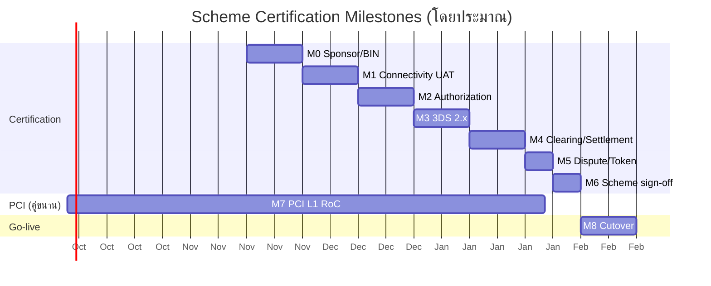
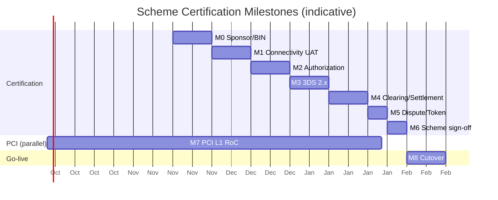

# แผนการรับรองกับเครือข่ายบัตร (Visa/Mastercard) (ไทย)

> เอกสารฉบับนี้เป็นส่วนหนึ่งของชุดเอกสารประกอบการยื่นขอใบอนุญาต **การให้บริการรับชำระเงินด้วยวิธีการทางอิเล็กทรอนิกส์ (Acquiring)**
> ภายใต้ **พ.ร.บ. ระบบการชำระเงิน พ.ศ. 2560** ต่อ **ธนาคารแห่งประเทศไทย (ธปท.)** และเป็นแผนงานเชิงปฏิบัติสำหรับ
> การรับรองระบบ (certification) กับเครือข่ายบัตร Visa และ Mastercard ผ่านธนาคารผู้สนับสนุน (sponsor bank / acquiring member)
> ควบคู่กับการได้รับการรับรอง **PCI-DSS v4.0 Level 1**
>
> **หมายเลขเอกสาร:** 24 · **เวอร์ชัน:** 0.1 · **เจ้าของเอกสาร:** [บริษัท / Company] — ฝ่าย Compliance & Payments
> **สถานะ:** ร่างเพื่อยื่นประกอบคำขอ (submission-ready draft)
>
> **ข้อสงวน:** เอกสารนี้เป็นข้อมูลอ้างอิงเชิงเทคนิค/ปฏิบัติการ ไม่ใช่คำแนะนำทางกฎหมาย เงื่อนไขและ test script จริงเป็นไปตามที่
> Visa/Mastercard และ sponsor bank กำหนด ณ เวลาที่รับรอง

---

## 1. วัตถุประสงค์และขอบเขต

**วัตถุประสงค์:** กำหนดแผนการรับรองระบบของ [บริษัท / Company] ในฐานะ **Full Acquiring Payment Gateway** กับเครือข่ายบัตร
Visa และ Mastercard ให้ผ่านการทดสอบ (certification / mandatory testing) ก่อนเปิดใช้งานจริง (go-live) โดยเชื่อมผ่าน
**sponsor bank** ที่เป็นสมาชิก (principal member) ของทั้งสองเครือข่าย

**ขอบเขตครอบคลุม:**
- Authorization ผ่าน card switch (ISO 8583 / acquirer host API)
- Clearing & Settlement (Visa BASE II / Mastercard IPM / GCMS)
- 3-D Secure 2.x (EMV 3DS) สำหรับ e-commerce
- Card-not-present (CNP) และ tokenization (network token / VTS / MDES หากอยู่ใน scope ระยะแรก)
- Dispute / chargeback message flow (Visa VROL / Mastercard Mastercom)

**นอกขอบเขตของเอกสารฉบับนี้** (มีเอกสารแยก): รายละเอียด PCI-DSS RoC, สถาปัตยกรรมระบบ (ดู `ARCHITECTURE.md`),
timeline โครงการรวม (ดู `ROADMAP.md`), นโยบาย AML/KYC (ปปง./AMLO), นโยบาย PDPA

> [!IMPORTANT]
> **สมมติฐานและรายการที่ยังไม่สรุป (TODO — ต้องยืนยันจากภายนอก):**
> 1. **Sponsor bank / acquiring member** — ยังไม่ลงนามสัญญา (ยังไม่ยืนยันผู้ให้บริการ) เงื่อนไข test script, BIN/ICA,
>    endpoint และกำหนดคิว certification ขึ้นกับ sponsor bank ที่เลือก **[TODO: ยืนยัน sponsor bank]**
> 2. **QSA vendor (PCI-DSS v4.0)** — ยังไม่เลือกผู้ประเมิน (Qualified Security Assessor) **[TODO: ล็อกสัญญา QSA]**
> 3. **ทุนจดทะเบียนชำระแล้วจริง** — เกณฑ์ ธปท. สำหรับ Acquiring คือขั้นต่ำ **50 ล้านบาท** และต้องคงไว้ ≥ 75% ตลอดการดำเนินงาน
>    ยอดที่ชำระจริง ณ วันยื่น **[TODO: ยืนยันตัวเลขทุนชำระแล้ว ณ วันยื่น]**
> 4. **BIN sponsorship / ICA number** — ออกโดย sponsor bank/scheme **[TODO]**
> 5. เวอร์ชัน test tool ของ scheme (เช่น Visa VTS/MTIP toolkit, Mastercard MTIP) และ mandate release ล่าสุด
>    ให้ยึดตามที่ scheme ประกาศ ณ ช่วงทดสอบ **[TODO: ยืนยันเวอร์ชัน mandate]**

---

## 2. ผู้เกี่ยวข้องและบทบาท (Roles & RACI)

| บทบาท | หน่วยงาน | ความรับผิดชอบหลัก |
|-------|----------|-------------------|
| **Certification Program Lead** | [บริษัท / Company] — Payments | เจ้าของแผน, ประสานงาน sponsor/scheme, ติดตาม milestone |
| **Integration Engineer (Acquirer/ISO 8583)** | [บริษัท / Company] — Backend (Go) | เชื่อม host API, สร้าง/รัน test script, แก้ defect |
| **3DS Engineer** | [บริษัท / Company] — Backend | EMV 3DS 2.x flow, ทดสอบ ACS/DS |
| **QA / Test Automation** | [บริษัท / Company] — QA | จัดการ test matrix, evidence, regression |
| **Security / DevSecOps** | [บริษัท / Company] — Security | PCI scope, HSM/KMS, network segmentation, key ceremony |
| **Compliance & Legal** | [บริษัท / Company] — Compliance | ประสาน ธปท., ปปง./AMLO, PDPC; เอกสารใบอนุญาต |
| **Sponsor Bank Relationship Manager** | Sponsor bank | ออก BIN/ICA, เปิด test endpoint, review & sign-off cert **[TODO]** |
| **Scheme Certification Analyst** | Visa / Mastercard | review test result, ออก Letter of Approval / cert sign-off |
| **QSA** | ผู้ประเมินภายนอก | PCI-DSS v4.0 audit, ออก RoC/AoC **[TODO]** |

### สรุป RACI (ย่อ)

| กิจกรรม | Program Lead | Integration | QA | Security | Sponsor | Scheme |
|---------|:---:|:---:|:---:|:---:|:---:|:---:|
| วางแผน & จอง slot cert | A | C | C | C | R | I |
| เชื่อม host/endpoint | A | R | C | C | R | I |
| รัน test script (auth/clearing) | A | R | R | I | C | I |
| 3DS 2.x testing | A | R | R | C | C | I |
| PCI evidence & RoC | C | C | C | R/A | I | I |
| Sign-off & Letter of Approval | A | I | I | I | R | R |

(R = ผู้ลงมือ, A = ผู้รับผิดชอบสูงสุด, C = ให้คำปรึกษา, I = รับทราบ)

---

## 3. เงื่อนไขเบื้องต้น (Prerequisites) ก่อนเริ่ม certification

1. **ลงนามสัญญากับ sponsor bank** และได้รับ **BIN (Visa) / ICA (Mastercard)** สำหรับ acquiring **[TODO]**
2. เชื่อมต่อ **acquirer host / card switch** ในสภาพแวดล้อม **sandbox/UAT** สำเร็จ (network + credential + mTLS)
3. **PCI-DSS v4.0 scope** กำหนดชัดเจน: tokenization vault แยก segment, ระบบหลักเห็นเฉพาะ token + `card_last4`
   (ไม่มี PAN/CVV/PIN/track ในฐานข้อมูลปฏิบัติการ)
4. **HSM/KMS** พร้อมใช้งานสำหรับ key management (PCI Req 3), ทำ key ceremony (dual control / split knowledge)
5. Ledger แบบ append-only (double-entry) และ reconciliation worker พร้อมทดสอบ settlement/clearing file
6. Idempotency + audit_log ครบทุก endpoint ที่ขยับเงิน
7. ได้รับ **test tool / simulator** ของ scheme และ **test card range** จาก sponsor bank

> การรับรอง scheme และ PCI-DSS L1 เป็น **critical path** ตาม `ROADMAP.md` (Phase 4) และต้องเริ่มคู่ขนานกับ engineering
> ตั้งแต่ต้น sponsor bank เป็นตัวกำหนดคิวและกำหนดเวลา

---

## 4. Test script / Test matrix

หมวดทดสอบและ script อ้างอิงจากชุดทดสอบมาตรฐานของแต่ละเครือข่าย (Visa ADVT/VTS/CVT, Mastercard MTIP/M-TIP)
รายละเอียดเคสจริงเป็นไปตามชุดที่ scheme และ sponsor bank มอบให้ ณ เวลาทดสอบ

### 4.1 Authorization (Visa ADVT / Mastercard MTIP — auth module)

| # | Test case | ข้อมูลนำเข้า | ผลลัพธ์ที่คาดหวัง |
|---|-----------|-------------|------------------|
| A-01 | Approve เต็มจำนวน | บัตรทดสอบ approve, MTI 0100 | 0110 approved, `auth_code`, ledger `authorize` |
| A-02 | Decline (insufficient funds) | test card decline code 51 | 0110 decline, ไม่มี ledger authorize |
| A-03 | Partial approval | รองรับ partial auth | 0110 approved partial, amount ตรง |
| A-04 | Referral / pickup (04, 41, 43) | test card | จัดการ response code ถูกต้อง, ไม่ capture |
| A-05 | AVS check | CNP + address | AVS response mapping ถูกต้อง |
| A-06 | CVV2 mismatch | CNP + wrong CVV2 | จัดการตาม policy (decline/flag) |
| A-07 | Timeout / no response | จำลอง timeout | fail-closed, ตั้ง reconcile, ไม่ double charge |
| A-08 | Reversal (auto/partial) | หลัง timeout/partial | ส่ง 0400/reversal สำเร็จ |
| A-09 | Currency & minor units | THB / อื่น ๆ | amount เป็น integer minor units ถูกต้อง |
| A-10 | Duplicate (idempotency) | ส่งซ้ำด้วย Idempotency-Key เดิม | ผลเดิม ไม่เกิด auth ซ้ำ |

### 4.2 Clearing & Settlement (Visa BASE II / Mastercard IPM · GCMS)

| # | Test case | ผลลัพธ์ที่คาดหวัง |
|---|-----------|------------------|
| C-01 | สร้าง clearing record จาก capture | field TCR/IPM ถูกต้อง, จำนวนตรงกับ auth |
| C-02 | Refund / credit | credit record ถูกต้อง, ledger `refund` |
| C-03 | Fee & interchange qualification | คำนวณ interchange/fee ตาม MCC |
| C-04 | Settlement file parse & reconcile | กระทบยอดกับ ledger, ไม่มี mismatch |
| C-05 | Exception / reject re-presentment | จัดการ reject และส่งใหม่ |
| C-06 | Cutoff / batch window | ปิด batch ตรงตาม cutoff ของ scheme |

### 4.3 EMV 3-D Secure 2.x (EMV 3DS)

| # | Test case | ผลลัพธ์ที่คาดหวัง |
|---|-----------|------------------|
| D-01 | Frictionless flow | authenticated, ECI/CAVV ส่งต่อ auth |
| D-02 | Challenge flow (OTP/biometric) | `requires_action` + `next_action_url`, สำเร็จ |
| D-03 | Authentication failed | mapping ถูกต้อง, ไม่ authorize |
| D-04 | Attempts / stand-in | ECI สำหรับ liability shift ถูกต้อง |
| D-05 | 3DS data ใน auth | CAVV/AAV, dsTransID, version ครบ |
| D-06 | Method / device data collection | 3DS Method URL ทำงานถูกต้อง |

### 4.4 Dispute / Chargeback

| # | Test case | ผลลัพธ์ที่คาดหวัง |
|---|-----------|------------------|
| E-01 | รับ chargeback (Visa VROL / Mastercom) | สร้าง dispute record, แจ้ง merchant |
| E-02 | Representment / re-presentment | ส่งหลักฐานสำเร็จ |
| E-03 | Second presentment / pre-arbitration | flow ถูกต้อง |

### 4.5 Network Tokenization (ถ้าอยู่ใน scope ระยะแรก — VTS / MDES)

| # | Test case | ผลลัพธ์ที่คาดหวัง |
|---|-----------|------------------|
| T-01 | Provision network token | token + TR-ID สำเร็จ |
| T-02 | Auth ด้วย network token + cryptogram | approved, cryptogram ถูกตรวจ |
| T-03 | Lifecycle (suspend/resume/delete) | สถานะ token ถูกต้อง |

> **หลักฐาน (evidence):** ทุกเคสต้องเก็บ request/response log (ปิดบัง PAN/sensitive data ตาม PCI Req 3),
> transaction ID, timestamp และผล pass/fail ลงใน certification evidence pack เพื่อส่ง scheme/sponsor และประกอบ RoC

---

## 5. Milestones และกำหนดเวลา (โดยประมาณ)

อ้างอิง `ROADMAP.md` Phase 4 (Certification & Go-live, สัปดาห์ 16–24+) certification เริ่มหลังสภาพแวดล้อม UAT พร้อม
วันที่เป็นค่าเป้าหมายเชิงวางแผน ปรับตามคิวจริงของ sponsor/scheme

| # | Milestone | เกณฑ์ผ่าน (exit criteria) | เป้าหมาย |
|---|-----------|---------------------------|----------|
| M0 | ลงนาม sponsor bank + ได้ BIN/ICA | สัญญาลงนาม, BIN/ICA ออก **[TODO]** | สัปดาห์ 0 |
| M1 | เชื่อม host UAT + connectivity test | ping/handshake/mTLS ผ่าน | +2 สัปดาห์ |
| M2 | ผ่าน Authorization test (ADVT/MTIP auth) | 100% เคสบังคับผ่าน | +4 สัปดาห์ |
| M3 | ผ่าน 3DS 2.x test | ครบทุกเคส frictionless/challenge | +6 สัปดาห์ |
| M4 | ผ่าน Clearing & Settlement test | reconcile ไม่มี mismatch | +8 สัปดาห์ |
| M5 | Dispute/chargeback + tokenization (ถ้ามี) | flow ผ่าน | +9 สัปดาห์ |
| M6 | Scheme sign-off / Letter of Approval | อนุมัติจาก Visa & Mastercard | +10 สัปดาห์ |
| M7 | PCI-DSS v4.0 L1 RoC/AoC ออกโดย QSA | RoC ผ่าน + ASV scan + pentest | คู่ขนาน (Q ตาม ROADMAP) |
| M8 | Production readiness + go-live cutover | DR drill, load test, sign-off ธปท. | +12 สัปดาห์ |

---

## 6. Dependencies (สิ่งที่ต้องพึ่งพา)

| Dependency | ประเภท | เจ้าของ | ผลกระทบถ้าล่าช้า |
|-----------|--------|---------|------------------|
| Sponsor bank + BIN/ICA | ภายนอก (critical) | Sponsor bank **[TODO]** | บล็อกทั้ง certification |
| Scheme test tool + test card range | ภายนอก | Visa / Mastercard | บล็อกการรัน test script |
| PCI-DSS v4.0 L1 (RoC/AoC) | ภายนอก | QSA **[TODO]** | บล็อก go-live (scheme ต้องเห็น) |
| HSM/KMS + key ceremony | ภายใน | Security | บล็อก tokenization / detokenize |
| UAT environment + reconcile worker | ภายใน | SRE / Backend | บล็อก clearing test |
| ใบอนุญาต Acquiring (ธปท.) | ภายนอก (regulatory) | ธปท. / Compliance | บล็อกการเปิดจริง (go-live) |
| ทุนชำระแล้ว ≥ 50 ล้าน (คงไว้ ≥ 75%) | ภายใน/regulatory | [บริษัท / Company] **[TODO]** | บล็อกใบอนุญาต |
| AML/KYC + sanction screening (ปปง./AMLO) | ภายใน/regulatory | Compliance | เงื่อนไขใบอนุญาต |
| PDPA controls (PDPC) | ภายใน/regulatory | Compliance / Security | เงื่อนไขใบอนุญาต |

---

## 7. การบริหารความเสี่ยง (Risk & mitigation)

| ความเสี่ยง | ระดับ | การลดความเสี่ยง |
|-----------|:---:|-----------------|
| Sponsor bank ล่าช้า/เปลี่ยนเงื่อนไข | สูง | เจรจา sponsor สำรอง, ล็อกคิว cert ล่วงหน้า |
| Test script fail ซ้ำ (defect) | กลาง | regression อัตโนมัติ, buffer เวลาในแต่ละ milestone |
| PCI RoC ไม่ทันก่อน go-live | สูง | เริ่ม QSA คู่ขนานตั้งแต่ Phase 2, ASV/pentest ตามรอบ |
| Reconciliation mismatch | กลาง | ledger append-only + ทดสอบ settlement file ตั้งแต่ Phase 1 |
| เปลี่ยน mandate/release ของ scheme | กลาง | ติดตาม release note, ยึดเวอร์ชันที่ประกาศ ณ ทดสอบ |
| Fail-closed ทำ transaction ค้าง | กลาง | reversal + reconcile อัตโนมัติ, alert |

---

## 8. Governance และการรายงาน

- **Weekly certification standup** — ติดตาม milestone, defect, blocker; บันทึกใน RAID log
- **Evidence management** — เก็บ evidence pack (log, screenshot, sign-off) ในที่เก็บที่ควบคุมการเข้าถึง (RBAC, audit)
- **Sign-off gate** — แต่ละ milestone ต้องมี sign-off จาก Program Lead + (สำหรับ M6) sponsor/scheme
- **รายงานต่อ ธปท.** — สถานะ certification และ PCI เป็นส่วนหนึ่งของเอกสารความพร้อมระบบในคำขอใบอนุญาต และรายงานเป็นงวดหลังได้ใบอนุญาต

---

# Card scheme certification plan (Visa/Mastercard) via sponsor bank: test scripts, milestones, dependencies (English)

> This document is part of the submission package for the **Acquiring (electronic payment acceptance) license**
> under the **Payment Systems Act B.E. 2560 (2017)** filed with the **Bank of Thailand (BOT / ธปท.)**. It is the operational
> plan to certify [บริษัท / Company]'s system with the **Visa** and **Mastercard** card schemes through a **sponsor bank
> (acquiring principal member)**, in parallel with achieving **PCI-DSS v4.0 Level 1** compliance.
>
> **Doc no.:** 24 · **Version:** 0.1 · **Owner:** [บริษัท / Company] — Compliance & Payments · **Status:** submission-ready draft
>
> **Disclaimer:** This is a technical/operational reference, not legal advice. Actual conditions and test scripts follow
> what Visa/Mastercard and the sponsor bank mandate at the time of certification.

---

## 1. Purpose & scope

**Purpose:** define the plan for [บริษัท / Company], acting as a **Full Acquiring Payment Gateway**, to pass Visa and
Mastercard mandatory certification / testing before production go-live, connecting through a **sponsor bank** that is a
principal member of both schemes.

**In scope:**
- Authorization via card switch (ISO 8583 / acquirer host API)
- Clearing & settlement (Visa BASE II / Mastercard IPM · GCMS)
- EMV 3-D Secure 2.x for e-commerce
- Card-not-present (CNP) and tokenization (network token / VTS / MDES if in first-phase scope)
- Dispute / chargeback message flow (Visa VROL / Mastercard Mastercom)

**Out of scope** (covered in separate docs): PCI-DSS RoC detail, system architecture (`ARCHITECTURE.md`), overall project
timeline (`ROADMAP.md`), AML/KYC policy (AMLO / ปปง.), PDPA policy (PDPC).

> [!IMPORTANT]
> **Assumptions & open items (TODO — external confirmation required):**
> 1. **Sponsor bank / acquiring member** — not yet contracted. Test scripts, BIN/ICA, endpoints and certification queue
>    depend on the chosen sponsor bank. **[TODO: confirm sponsor bank]**
> 2. **QSA vendor (PCI-DSS v4.0)** — Qualified Security Assessor not yet selected. **[TODO: lock QSA contract]**
> 3. **Actual paid-up capital** — BOT threshold for Acquiring is a minimum of **THB 50M**, to be maintained at ≥ 75%
>    throughout operations. Actual paid-up amount at filing date **[TODO: confirm]**.
> 4. **BIN sponsorship / ICA number** — issued by sponsor bank / scheme. **[TODO]**
> 5. Scheme test-tool versions (e.g. Visa VTS/ADVT toolkit, Mastercard MTIP) and latest mandate release — follow what
>    the scheme publishes at test time. **[TODO: confirm mandate version]**

---

## 2. Roles & RACI

| Role | Org | Primary responsibility |
|------|-----|------------------------|
| **Certification Program Lead** | [บริษัท / Company] — Payments | Plan owner; coordinates sponsor/scheme; tracks milestones |
| **Integration Engineer (Acquirer/ISO 8583)** | [บริษัท / Company] — Backend (Go) | Host API integration; build/run test scripts; fix defects |
| **3DS Engineer** | [บริษัท / Company] — Backend | EMV 3DS 2.x flows; ACS/DS testing |
| **QA / Test Automation** | [บริษัท / Company] — QA | Test matrix, evidence, regression |
| **Security / DevSecOps** | [บริษัท / Company] — Security | PCI scope, HSM/KMS, segmentation, key ceremony |
| **Compliance & Legal** | [บริษัท / Company] — Compliance | Liaison with BOT, AMLO, PDPC; license docs |
| **Sponsor Bank Relationship Manager** | Sponsor bank | Issues BIN/ICA, opens test endpoints, reviews & signs off cert **[TODO]** |
| **Scheme Certification Analyst** | Visa / Mastercard | Reviews results, issues Letter of Approval / sign-off |
| **QSA** | External assessor | PCI-DSS v4.0 audit; issues RoC/AoC **[TODO]** |

### RACI summary

| Activity | Program Lead | Integration | QA | Security | Sponsor | Scheme |
|----------|:---:|:---:|:---:|:---:|:---:|:---:|
| Plan & book cert slots | A | C | C | C | R | I |
| Host/endpoint connectivity | A | R | C | C | R | I |
| Run test scripts (auth/clearing) | A | R | R | I | C | I |
| 3DS 2.x testing | A | R | R | C | C | I |
| PCI evidence & RoC | C | C | C | R/A | I | I |
| Sign-off & Letter of Approval | A | I | I | I | R | R |

(R = Responsible, A = Accountable, C = Consulted, I = Informed)

---

## 3. Prerequisites before certification

1. **Sponsor bank contract signed** and **BIN (Visa) / ICA (Mastercard)** issued for acquiring **[TODO]**
2. Connectivity to the **acquirer host / card switch** established in **sandbox/UAT** (network + credentials + mTLS)
3. **PCI-DSS v4.0 scope** defined: tokenization vault in a separate segment; core system sees only token + `card_last4`
   (no PAN/CVV/PIN/track in the operational DB)
4. **HSM/KMS** operational for key management (PCI Req 3); key ceremony done (dual control / split knowledge)
5. Append-only double-entry ledger and reconciliation worker ready to test settlement/clearing files
6. Idempotency + audit_log on every money-moving endpoint
7. Scheme **test tools / simulators** and **test card ranges** obtained from sponsor bank

> Scheme certification and PCI-DSS L1 are the **critical path** (see `ROADMAP.md` Phase 4) and must run in parallel with
> engineering from the start. The sponsor bank drives the queue and timeline.

---

## 4. Test scripts / test matrix

Test categories reference each network's standard suite (Visa ADVT/VTS/CVT, Mastercard MTIP/M-TIP). Actual cases follow
the suite provided by the scheme and sponsor bank at test time.

### 4.1 Authorization (Visa ADVT / Mastercard MTIP — auth module)

| # | Test case | Input | Expected result |
|---|-----------|-------|-----------------|
| A-01 | Full approval | approve test card, MTI 0100 | 0110 approved, `auth_code`, ledger `authorize` |
| A-02 | Decline (insufficient funds) | decline code 51 test card | 0110 decline, no ledger authorize |
| A-03 | Partial approval | partial-auth capable | 0110 approved partial, amount matches |
| A-04 | Referral / pickup (04, 41, 43) | test card | correct response-code handling, no capture |
| A-05 | AVS check | CNP + address | correct AVS response mapping |
| A-06 | CVV2 mismatch | CNP + wrong CVV2 | handle per policy (decline/flag) |
| A-07 | Timeout / no response | simulated timeout | fail-closed, schedule reconcile, no double charge |
| A-08 | Reversal (auto/partial) | after timeout/partial | send 0400/reversal successfully |
| A-09 | Currency & minor units | THB / others | amount as integer minor units correct |
| A-10 | Duplicate (idempotency) | resend with same Idempotency-Key | same result, no duplicate auth |

### 4.2 Clearing & settlement (Visa BASE II / Mastercard IPM · GCMS)

| # | Test case | Expected result |
|---|-----------|-----------------|
| C-01 | Build clearing record from capture | correct TCR/IPM fields, amount matches auth |
| C-02 | Refund / credit | correct credit record, ledger `refund` |
| C-03 | Fee & interchange qualification | interchange/fee computed per MCC |
| C-04 | Settlement file parse & reconcile | reconciles to ledger, no mismatch |
| C-05 | Exception / reject re-presentment | handle reject and resubmit |
| C-06 | Cutoff / batch window | batch closes at scheme cutoff |

### 4.3 EMV 3-D Secure 2.x

| # | Test case | Expected result |
|---|-----------|-----------------|
| D-01 | Frictionless flow | authenticated, ECI/CAVV passed to auth |
| D-02 | Challenge flow (OTP/biometric) | `requires_action` + `next_action_url`, succeeds |
| D-03 | Authentication failed | correct mapping, no authorize |
| D-04 | Attempts / stand-in | correct ECI for liability shift |
| D-05 | 3DS data in auth | CAVV/AAV, dsTransID, version present |
| D-06 | Method / device data collection | 3DS Method URL works |

### 4.4 Dispute / chargeback

| # | Test case | Expected result |
|---|-----------|-----------------|
| E-01 | Receive chargeback (Visa VROL / Mastercom) | create dispute record, notify merchant |
| E-02 | Representment / re-presentment | evidence submitted successfully |
| E-03 | Second presentment / pre-arbitration | correct flow |

### 4.5 Network tokenization (if in first-phase scope — VTS / MDES)

| # | Test case | Expected result |
|---|-----------|-----------------|
| T-01 | Provision network token | token + TR-ID success |
| T-02 | Auth with network token + cryptogram | approved, cryptogram validated |
| T-03 | Lifecycle (suspend/resume/delete) | correct token state |

> **Evidence:** every case captures request/response logs (PAN/sensitive data masked per PCI Req 3), transaction ID,
> timestamp and pass/fail into the certification evidence pack, submitted to scheme/sponsor and supporting the RoC.

---

## 5. Milestones & timeline (indicative)

Per `ROADMAP.md` Phase 4 (Certification & Go-live, weeks 16–24+); certification starts after the UAT environment is ready.
Dates are planning targets, adjusted to the sponsor/scheme's actual queue.

| # | Milestone | Exit criteria | Target |
|---|-----------|---------------|--------|
| M0 | Sponsor bank signed + BIN/ICA | contract signed, BIN/ICA issued **[TODO]** | week 0 |
| M1 | Host UAT + connectivity test | ping/handshake/mTLS pass | +2 wk |
| M2 | Pass Authorization tests (ADVT/MTIP auth) | 100% mandatory cases pass | +4 wk |
| M3 | Pass 3DS 2.x tests | all frictionless/challenge cases | +6 wk |
| M4 | Pass Clearing & Settlement tests | reconcile with no mismatch | +8 wk |
| M5 | Dispute/chargeback + tokenization (if any) | flows pass | +9 wk |
| M6 | Scheme sign-off / Letter of Approval | approval from Visa & Mastercard | +10 wk |
| M7 | PCI-DSS v4.0 L1 RoC/AoC by QSA | RoC pass + ASV scan + pentest | parallel (per ROADMAP) |
| M8 | Production readiness + go-live cutover | DR drill, load test, BOT sign-off | +12 wk |

---

## 6. Dependencies

| Dependency | Type | Owner | Impact if delayed |
|-----------|------|-------|-------------------|
| Sponsor bank + BIN/ICA | External (critical) | Sponsor bank **[TODO]** | Blocks all certification |
| Scheme test tool + test card range | External | Visa / Mastercard | Blocks test-script runs |
| PCI-DSS v4.0 L1 (RoC/AoC) | External | QSA **[TODO]** | Blocks go-live (scheme requires it) |
| HSM/KMS + key ceremony | Internal | Security | Blocks tokenization / detokenize |
| UAT environment + reconcile worker | Internal | SRE / Backend | Blocks clearing test |
| Acquiring license (BOT) | External (regulatory) | BOT / Compliance | Blocks production go-live |
| Paid-up capital ≥ THB 50M (≥ 75% maintained) | Internal/regulatory | [บริษัท / Company] **[TODO]** | Blocks license |
| AML/KYC + sanction screening (AMLO) | Internal/regulatory | Compliance | License condition |
| PDPA controls (PDPC) | Internal/regulatory | Compliance / Security | License condition |

---

## 7. Risk & mitigation

| Risk | Level | Mitigation |
|------|:---:|-----------|
| Sponsor bank delay / changed terms | High | Negotiate backup sponsor; book cert queue early |
| Repeated test-script failures (defects) | Med | Automated regression; time buffer per milestone |
| PCI RoC not ready before go-live | High | Start QSA in parallel from Phase 2; ASV/pentest on schedule |
| Reconciliation mismatch | Med | Append-only ledger + settlement-file testing from Phase 1 |
| Scheme mandate/release change | Med | Track release notes; pin version published at test time |
| Fail-closed leaves stuck transactions | Med | Automated reversal + reconcile; alerting |

---

## 8. Governance & reporting

- **Weekly certification standup** — track milestones, defects, blockers; recorded in a RAID log.
- **Evidence management** — store the evidence pack (logs, screenshots, sign-offs) in access-controlled storage (RBAC, audit).
- **Sign-off gate** — each milestone requires Program Lead sign-off, and (for M6) sponsor/scheme sign-off.
- **BOT reporting** — certification and PCI status form part of the system-readiness evidence in the license application,
  and are reported periodically after the license is granted.

---

## Related documents

- `../COMPLIANCE-TH.md` — Thai law, license categories, application steps
- `../ARCHITECTURE.md` — system architecture, transaction flows, PCI-DSS controls
- `../ROADMAP.md` — phases, timeline, cost estimates
