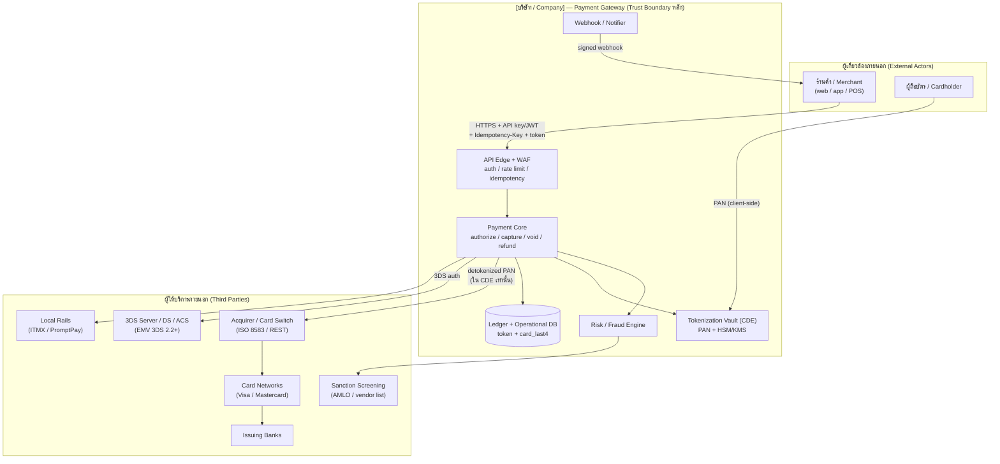
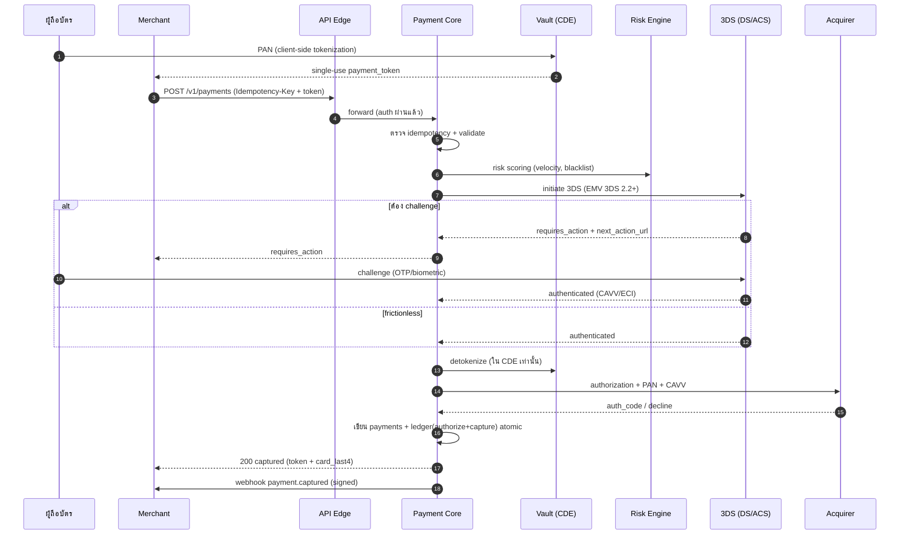
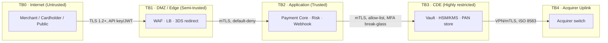
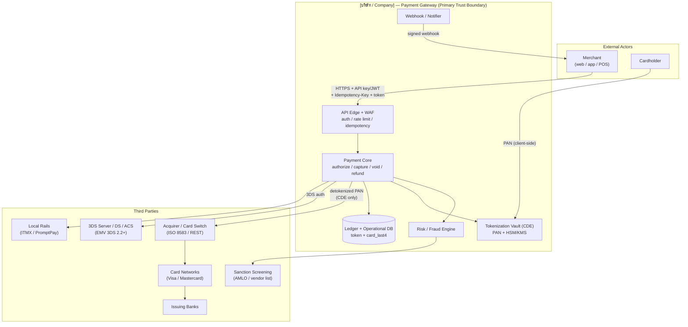
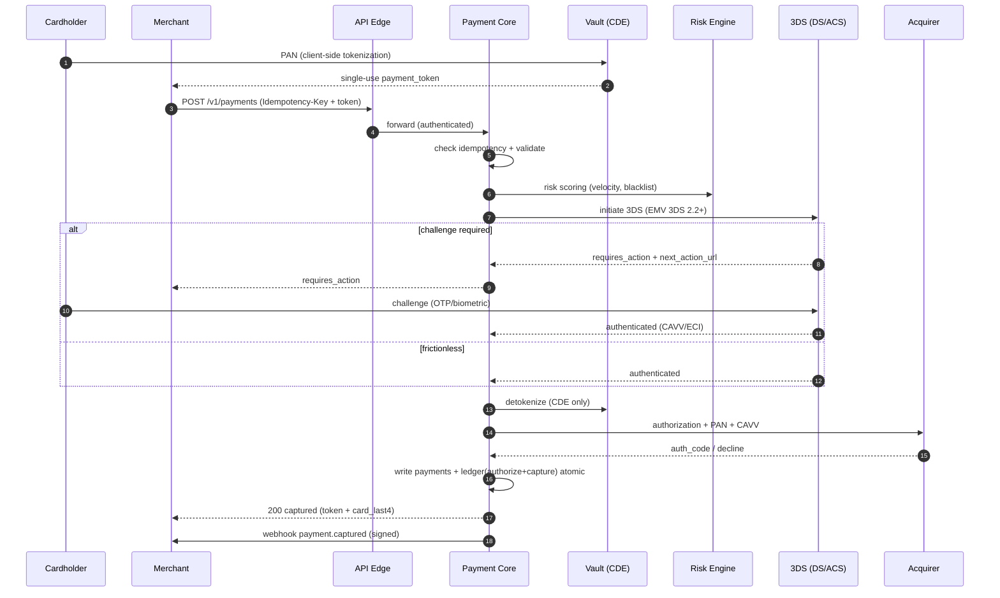

# แผนภาพสถาปัตยกรรมระบบและกระแสข้อมูล (ไทย)

> เอกสารประกอบการยื่นขอใบอนุญาต **การให้บริการรับชำระเงินด้วยวิธีการทางอิเล็กทรอนิกส์ (Full Acquiring)**
> ภายใต้ พ.ร.บ. ระบบการชำระเงิน พ.ศ. 2560 ต่อธนาคารแห่งประเทศไทย (ธปท.) และเป็นเอกสารประกอบการประเมิน PCI-DSS v4.0 Level 1 (Requirement 1, 3, 4)
>
> เอกสารเลขที่: `COMP-34` · เวอร์ชัน 1.0 · เจ้าของเอกสาร: Chief Technology Officer (CTO) / Chief Information Security Officer (CISO)
> เอกสารอ้างอิง: `COMPLIANCE-TH.md`, `ARCHITECTURE.md`, `ROADMAP.md`, `docs/compliance/13-it-risk-management.md`, `docs/compliance/19-pci-dss-roadmap.md`, `docs/compliance/20-network-segmentation-cde.md`, `docs/compliance/21-tokenization-hsm-keymgmt.md`, `docs/compliance/22-3ds-strategy.md`
>
> **หมายเหตุ:** เอกสารนี้เป็นเอกสารเชิงเทคนิค/นโยบายภายใน ไม่ใช่คำแนะนำทางกฎหมาย ต้องผ่านการทบทวนโดยที่ปรึกษากฎหมายและ QSA ก่อนยื่นจริง

---

> ### ⚠️ ข้อสมมติและสิ่งที่ยังต้องยืนยัน (Assumptions / TODO)
> รายการต่อไปนี้ยังขึ้นกับคู่สัญญา/ผู้ให้บริการภายนอกที่ยังไม่สรุป — ห้ามถือเป็นข้อเท็จจริงจนกว่าจะยืนยัน:
> - **[TODO — Sponsor Bank / Acquirer]** ยังไม่ลงนามธนาคารผู้รับเชื่อม (sponsoring bank) และ card scheme (Visa/Mastercard) — โปรโตคอลจริง (ISO 8583 vs REST), รูปแบบการเชื่อม (leased line / MPLS / IPsec VPN), BIN sponsorship และ settlement cut-off จะยืนยันได้หลังลงนาม
> - **[TODO — QSA / ASV]** ยังไม่เลือกผู้ประเมิน PCI-DSS (Qualified Security Assessor) และผู้ให้บริการ ASV — การยืนยันขอบเขต (scope) และ trust boundary ในเอกสารนี้ต้องผ่านการรับรองโดย QSA (PCI Req 12.5.2)
> - **[TODO — 3DS Provider / Directory Server]** ยังไม่เลือกผู้ให้บริการ 3DS Server / MPI (EMV 3DS 2.2+) — endpoint ของ DS/ACS และ certification กับ scheme ต้องยืนยัน
> - **[TODO — HSM/KMS Vendor]** ยังไม่เลือกผู้ให้บริการ HSM/KMS (on-prem HSM ที่ผ่าน FIPS 140-2/140-3 Level 3 หรือ cloud HSM) — ดู `COMP-21`
> - **[TODO — Cloud / Data Residency]** ผู้ให้บริการ cloud และ region ยังไม่สรุป — ต้องเก็บข้อมูลในไทยตามข้อกำหนด ธปท./PDPA (ARCHITECTURE §8)
> - **[TODO — ทุนจดทะเบียน]** ทุนจดทะเบียนชำระแล้วเป้าหมาย **50 ล้านบาท** (Full Acquiring) — ต้องยืนยันจำนวนที่ชำระจริงและรักษาไว้ ≥ 75% ตลอดการดำเนินงาน
> - **[TODO — ชื่อบริษัท / รายละเอียดจริง]** ชื่อ `[บริษัท / Company]`, VPC/subscription, ช่วง IP/VLAN, ชื่อผู้ให้บริการ SaaS จริง ต้องเติมค่าจริงก่อนยื่นและก่อนการประเมิน on-site

---

## 1. วัตถุประสงค์และขอบเขต

เอกสารนี้อธิบาย (ก) สถาปัตยกรรมระบบระดับ context และ component, (ข) แผนภาพกระแสข้อมูล (data-flow diagram – DFD) แบบ mermaid สำหรับเส้นทางการชำระเงินหลัก, (ค) รายชื่อผู้ให้บริการภายนอก (third parties) และประเภทข้อมูลที่แลกเปลี่ยน, (ง) ขอบเขตความไว้วางใจ (trust boundaries) และ (จ) ขอบเขต PCI-DSS (PCI scope) ของ `[บริษัท / Company]`

เอกสารนี้เป็นภาพรวมที่ผูกโยงเอกสารเชิงลึกอื่น: การแบ่งเครือข่ายดู `COMP-20`, tokenization/HSM ดู `COMP-21`, 3DS ดู `COMP-22`, PCI roadmap ดู `COMP-19`

**หลักการนำ (จาก ARCHITECTURE §2):** cardholder data ต้องออกจาก scope ให้มากที่สุด — ระบบหลักเห็นเพียง `token` + `card_last4` + `card_brand`; ledger เป็น source of truth แบบ append-only; ทุก endpoint ที่ขยับเงินต้อง idempotent; fail-closed เมื่อไม่แน่ใจสถานะ

---

## 2. สถาปัตยกรรมระดับ Context (System Context Diagram)

**คำอธิบาย trust boundary หลัก:** เส้นขอบกล่อง `PG` คือขอบเขตความไว้วางใจหลัก ทุก request จากภายนอกต้องผ่าน API Edge (authentication + rate limit) ก่อนเข้าถึง Payment Core; PAN ที่ยังไม่ถูก tokenize ถูกจำกัดให้อยู่เฉพาะภายใน Tokenization Vault (CDE) เท่านั้น

---

## 3. สถาปัตยกรรมระดับ Component และการแมปกับ PCI Scope

| Component | หน้าที่ | โซนเครือข่าย (ดู COMP-20) | PCI Scope | โฟลเดอร์ในโปรเจ็ค |
|-----------|--------|--------------------------|-----------|-------------------|
| API Edge / Middleware | rate limit, auth (API key/JWT), request-id, idempotency, logging | Z1/Z2 | Connected-to | `internal/middleware` |
| Payment Core (Service) | authorize / capture / void / refund + state machine | Z2 | Connected-to (security-impacting) | `internal/service` |
| **Tokenization Vault** | เก็บ/คืน PAN เข้ารหัสด้วย HSM/KMS | **Z3** | **In-scope CDE** | บริการแยก + `internal/pkg/crypto` |
| Acquirer Adapter | คุยกับ card switch (ISO 8583/REST), ส่ง PAN | Z6 | In-scope (transmits CHD) | `internal/external` |
| 3DS Adapter | EMV 3DS 2.2+ authentication | Z1/Z2 | Connected-to | `internal/pkg/threeds` |
| Risk / Fraud Engine | scoring, velocity, blacklist, sanction feed | Z2 | Connected-to | `internal/service` |
| Ledger | รายการเงิน append-only (double-entry) | Z4 | Connected-to (ไม่มี PAN) | ตาราง `ledger_entries` |
| Webhook / Notifier | แจ้ง merchant at-least-once + retry + signature | Z2 | Connected-to | ตาราง `webhook_events` |
| Reconciliation / Settlement | กระทบยอด acquirer, payout merchant | Z4/Z6 | Connected-to | worker แยก (Phase 3) |
| SIEM / Log / Secrets | logging, monitoring, secrets manager | Z5 | Connected-to (security-impacting) | infra |

> **สรุป scope:** เฉพาะ **Z3 (Vault)** เป็น CDE เต็มรูปแบบ และเส้นทาง **Z3 → Z6 (Acquirer uplink)** ที่ส่งผ่าน PAN อยู่ใน scope ระบบอื่นเป็น *connected-to* เพราะเห็นเพียง token — ทำให้ scope แคบและลดต้นทุนการประเมิน (PCI Req 12.5.2)

---

## 4. แผนภาพกระแสข้อมูล — Authorize + Capture (มี 3DS)

**จุดสำคัญด้านข้อมูล:** PAN เต็มปรากฏเฉพาะระหว่าง `VAULT` และ `ACQ` (ภายใน CDE) เท่านั้น; ทุกอย่างที่ตอบกลับ merchant และเก็บใน operational DB เป็น token + `card_last4` — สอดคล้อง PCI Req 3.3/3.4 (ห้ามเก็บ SAD, ปิดบัง PAN)

### 4.1 Refund / Void (ย่อ)
- **Refund:** `POST /v1/payments/{id}/refund` → ตรวจ `refunded + amount ≤ captured` → ส่ง refund ไป acquirer → `ledger(refund)` → `partial_refunded`/`refunded`
- **Void:** `POST /v1/payments/{id}/void` (ก่อน capture เท่านั้น) → reverse authorization → `voided`

---

## 5. ผู้ให้บริการภายนอก (Third Parties) และข้อมูลที่แลกเปลี่ยน

| ผู้ให้บริการ | ประเภท | ข้อมูลที่แลกเปลี่ยน | ทิศทาง | กลไกความปลอดภัย | สัญญา/กำกับ |
|-------------|--------|-------------------|--------|-----------------|-------------|
| Sponsor Bank / Acquirer | Critical | PAN, auth_code, settlement | สองทาง | mTLS / VPN, ISO 8583 | Acquiring agreement, ธปท. outsourcing **[TODO]** |
| Card Scheme (Visa/MC) | Critical | authorization, clearing | ผ่าน acquirer | scheme spec | scheme cert (`COMP-24`) |
| 3DS Server / DS / ACS | Critical | device data, CAVV/ECI (ไม่มี PAN เต็ม) | สองทาง | TLS 1.2+, EMV 3DS | vendor DPA **[TODO]** |
| HSM / KMS | Critical | key material (ไม่ export) | สองทาง | FIPS 140-2/3 L3, dual control | vendor SLA (`COMP-21`) **[TODO]** |
| Local Rails (ITMX/PromptPay) | Important | QR/account ref (ไม่มี PAN) | สองทาง | mTLS | scheme rules |
| Sanction Screening Vendor | Important | ชื่อ/รายการเทียบ (PII) | ออก | TLS, DPA | PDPA + ปปง./AMLO (`COMP-06`) |
| Cloud / Infra Provider | Important | ระบบ hosting (data residency TH) | — | encryption, IAM | DPA, data residency **[TODO]** |
| QSA / ASV / Pentest | Assessor | evidence, scan results | — | NDA | engagement (`COMP-23`) **[TODO]** |
| Notification (email/SMS) | Support | ข้อมูลติดต่อ merchant (PII) | ออก | TLS, no card data | DPA (`COMP-10`) |

> ผู้ให้บริการทุกรายที่ประมวลผล CHD หรือ security-impacting ต้องมีในทะเบียน outsourcing และ TPRM ตามประกาศ ธปท. ว่าด้วยการใช้บริการภายนอก และมี DPA ตาม PDPA (มาตรา 40) — ดู `COMP-10`, `COMP-13`

---

## 6. ขอบเขตความไว้วางใจ (Trust Boundaries)

| Boundary | จาก → ไป | การควบคุมที่ข้ามขอบ |
|----------|----------|---------------------|
| TB0→TB1 | Internet → Edge | TLS 1.2+, WAF, DDoS scrubbing, API key/JWT, rate limit, idempotency |
| TB1→TB2 | Edge → App | mTLS, security group default-deny, request-id, input validation (sqlc) |
| TB2→TB3 | App → CDE | mTLS + allow-list เฉพาะ service account; MFA/break-glass; ไม่มี direct human access; ทุก detokenize ลง audit_log |
| TB3→TB4 | CDE → Acquirer | dedicated VPN/leased line, mTLS, ISO 8583; PAN เข้ารหัส in-transit |
| ทุกขอบ | — | logging ไม่มี card data (Req 10), fail-closed, least privilege (Req 7-8) |

---

## 7. ขอบเขต PCI-DSS (PCI Scope Summary)

- **PCI-DSS v4.0 Level 1** (> 6 ล้านรายการ/ปี หรือกำหนดโดย acquirer/แบรนด์บัตร) → ต้องมี QSA ออก RoC ประจำปี + quarterly ASV scan + annual penetration test (`COMP-19`, `COMP-23`)
- **CDE เต็มรูปแบบ:** เฉพาะ Z3 (Tokenization Vault + HSM/KMS + encrypted PAN store) และเส้นทาง Z3→Z6 (Acquirer uplink) — ดู `COMP-20`, `COMP-21`
- **Connected-to / security-impacting:** API Edge, Payment Core, Risk Engine, Webhook, Ledger DB, Z5 management (SIEM/secrets/bastion)
- **Out-of-scope (พิสูจน์ segmentation):** ระบบ corporate IT, marketing, dev workstations ที่ไม่มีเส้นทางเข้าถึง CDE — ยืนยันด้วย penetration test (PCI Req 11.4.5)
- **ห้ามเด็ดขาด:** เก็บ full PAN, CVV/CVV2, PIN, full track ใน operational DB (Req 3.2/3.3); เก็บได้เพียง `card_brand` + `card_last4`

| PCI Req หลักที่เอกสารนี้รองรับ | หัวข้อ |
|------------------------------|--------|
| Req 1 | network security controls, segmentation (`COMP-20`) |
| Req 3, 4 | protect stored/transmitted CHD, tokenization (`COMP-21`) |
| Req 7, 8 | least privilege, MFA (`COMP-18`) |
| Req 10 | logging ไม่มี card data, SIEM (`COMP-14`) |
| Req 12.5.2 | scope validation ประจำปี (เอกสารนี้ + QSA) |

---

# System architecture + data-flow diagrams (mermaid), third parties, trust boundaries, PCI scope (English)

> Supporting document for the **Electronic Payment Acquiring Service (Full Acquiring)** license application
> under the Payment Systems Act B.E. 2560 to the Bank of Thailand (BOT), and supporting evidence for the PCI-DSS v4.0 Level 1 assessment (Requirements 1, 3, 4).
>
> Document ID: `COMP-34` · Version 1.0 · Owner: Chief Technology Officer (CTO) / Chief Information Security Officer (CISO)
> References: `COMPLIANCE-TH.md`, `ARCHITECTURE.md`, `ROADMAP.md`, `docs/compliance/13-it-risk-management.md`, `docs/compliance/19-pci-dss-roadmap.md`, `docs/compliance/20-network-segmentation-cde.md`, `docs/compliance/21-tokenization-hsm-keymgmt.md`, `docs/compliance/22-3ds-strategy.md`
>
> **Note:** This is an internal technical/policy document, not legal advice. It must be reviewed by legal counsel and the QSA before actual submission.

---

> ### ⚠️ Assumptions / TODO
> The following items depend on external parties/vendors that are not yet finalized — do not treat as fact until confirmed:
> - **[TODO — Sponsor Bank / Acquirer]** No signed sponsoring bank or card scheme (Visa/Mastercard) yet — actual protocol (ISO 8583 vs REST), link type (leased line / MPLS / IPsec VPN), BIN sponsorship, and settlement cut-off will be confirmed after signing.
> - **[TODO — QSA / ASV]** No PCI-DSS Qualified Security Assessor or ASV selected yet — the scope and trust-boundary determination in this document must be validated by the QSA (PCI Req 12.5.2).
> - **[TODO — 3DS Provider / Directory Server]** No 3DS Server / MPI (EMV 3DS 2.2+) provider selected — DS/ACS endpoints and scheme certification to be confirmed.
> - **[TODO — HSM/KMS Vendor]** No HSM/KMS vendor selected (on-prem HSM certified to FIPS 140-2/140-3 Level 3, or cloud HSM) — see `COMP-21`.
> - **[TODO — Cloud / Data Residency]** Cloud provider and region not finalized — data must reside in Thailand per BOT/PDPA requirements (ARCHITECTURE §8).
> - **[TODO — Registered Capital]** Target paid-up registered capital **THB 50 million** (Full Acquiring) — actual paid-up amount to be confirmed and maintained at ≥ 75% throughout operations.
> - **[TODO — Company name / real details]** `[บริษัท / Company]` name, VPC/subscription, IP/VLAN ranges, and actual SaaS vendor names must be filled with real values before submission and before the on-site assessment.

---

## 1. Purpose and Scope

This document describes (a) the context- and component-level system architecture, (b) mermaid data-flow diagrams (DFDs) for the primary payment paths, (c) the list of third parties and the data types exchanged, (d) trust boundaries, and (e) the PCI-DSS scope of `[บริษัท / Company]`.

It is an overview that links to deeper documents: network segmentation in `COMP-20`, tokenization/HSM in `COMP-21`, 3DS in `COMP-22`, and the PCI roadmap in `COMP-19`.

**Guiding principles (from ARCHITECTURE §2):** cardholder data is kept out of scope as much as possible — the core system sees only `token` + `card_last4` + `card_brand`; the ledger is an append-only source of truth; every money-moving endpoint is idempotent; the system fails closed when transaction status is uncertain.

---

## 2. System Context Diagram

**Primary trust boundary:** the `PG` box is the primary trust boundary. Every external request must pass through the API Edge (authentication + rate limit) before reaching the Payment Core; un-tokenized PAN is confined strictly within the Tokenization Vault (CDE).

---

## 3. Component Architecture and PCI Scope Mapping

| Component | Function | Network zone (see COMP-20) | PCI Scope | Project folder |
|-----------|----------|----------------------------|-----------|----------------|
| API Edge / Middleware | rate limit, auth (API key/JWT), request-id, idempotency, logging | Z1/Z2 | Connected-to | `internal/middleware` |
| Payment Core (Service) | authorize / capture / void / refund + state machine | Z2 | Connected-to (security-impacting) | `internal/service` |
| **Tokenization Vault** | store/return PAN encrypted via HSM/KMS | **Z3** | **In-scope CDE** | separate service + `internal/pkg/crypto` |
| Acquirer Adapter | talks to card switch (ISO 8583/REST), transmits PAN | Z6 | In-scope (transmits CHD) | `internal/external` |
| 3DS Adapter | EMV 3DS 2.2+ authentication | Z1/Z2 | Connected-to | `internal/pkg/threeds` |
| Risk / Fraud Engine | scoring, velocity, blacklist, sanction feed | Z2 | Connected-to | `internal/service` |
| Ledger | append-only (double-entry) money entries | Z4 | Connected-to (no PAN) | `ledger_entries` table |
| Webhook / Notifier | merchant notify at-least-once + retry + signature | Z2 | Connected-to | `webhook_events` table |
| Reconciliation / Settlement | acquirer recon, merchant payout | Z4/Z6 | Connected-to | separate worker (Phase 3) |
| SIEM / Log / Secrets | logging, monitoring, secrets manager | Z5 | Connected-to (security-impacting) | infra |

> **Scope summary:** only **Z3 (Vault)** is full CDE, and the **Z3 → Z6 (Acquirer uplink)** path that transmits PAN is in scope. All other systems are *connected-to* because they see only tokens — keeping scope narrow and reducing assessment cost (PCI Req 12.5.2).

---

## 4. Data-Flow Diagram — Authorize + Capture (with 3DS)

**Key data point:** full PAN appears only between `VAULT` and `ACQ` (inside the CDE); everything returned to the merchant and stored in the operational DB is token + `card_last4` — consistent with PCI Req 3.3/3.4 (no SAD storage, PAN masking).

### 4.1 Refund / Void (summary)
- **Refund:** `POST /v1/payments/{id}/refund` → verify `refunded + amount ≤ captured` → send refund to acquirer → `ledger(refund)` → `partial_refunded`/`refunded`.
- **Void:** `POST /v1/payments/{id}/void` (pre-capture only) → reverse authorization → `voided`.

---

## 5. Third Parties and Data Exchanged

| Provider | Type | Data exchanged | Direction | Security mechanism | Contract / oversight |
|----------|------|----------------|-----------|--------------------|----------------------|
| Sponsor Bank / Acquirer | Critical | PAN, auth_code, settlement | bidirectional | mTLS / VPN, ISO 8583 | Acquiring agreement, BOT outsourcing **[TODO]** |
| Card Scheme (Visa/MC) | Critical | authorization, clearing | via acquirer | scheme spec | scheme cert (`COMP-24`) |
| 3DS Server / DS / ACS | Critical | device data, CAVV/ECI (no full PAN) | bidirectional | TLS 1.2+, EMV 3DS | vendor DPA **[TODO]** |
| HSM / KMS | Critical | key material (non-exportable) | bidirectional | FIPS 140-2/3 L3, dual control | vendor SLA (`COMP-21`) **[TODO]** |
| Local Rails (ITMX/PromptPay) | Important | QR/account ref (no PAN) | bidirectional | mTLS | scheme rules |
| Sanction Screening Vendor | Important | name/match records (PII) | outbound | TLS, DPA | PDPA + AMLO (`COMP-06`) |
| Cloud / Infra Provider | Important | hosting (data residency TH) | — | encryption, IAM | DPA, data residency **[TODO]** |
| QSA / ASV / Pentest | Assessor | evidence, scan results | — | NDA | engagement (`COMP-23`) **[TODO]** |
| Notification (email/SMS) | Support | merchant contact (PII) | outbound | TLS, no card data | DPA (`COMP-10`) |

> Every provider that processes CHD or is security-impacting must be entered in the outsourcing/TPRM register per the BOT outsourcing notification, and have a DPA under PDPA (Section 40) — see `COMP-10`, `COMP-13`.

---

## 6. Trust Boundaries

| Boundary | From → To | Controls crossing the boundary |
|----------|-----------|--------------------------------|
| TB0→TB1 | Internet → Edge | TLS 1.2+, WAF, DDoS scrubbing, API key/JWT, rate limit, idempotency |
| TB1→TB2 | Edge → App | mTLS, security-group default-deny, request-id, input validation (sqlc) |
| TB2→TB3 | App → CDE | mTLS + allow-list to service accounts only; MFA/break-glass; no direct human access; every detokenize logged to audit_log |
| TB3→TB4 | CDE → Acquirer | dedicated VPN/leased line, mTLS, ISO 8583; PAN encrypted in transit |
| all boundaries | — | logging with no card data (Req 10), fail-closed, least privilege (Req 7-8) |

---

## 7. PCI-DSS Scope Summary

- **PCI-DSS v4.0 Level 1** (> 6M transactions/year or as designated by acquirer/card brand) → requires a QSA-issued RoC annually + quarterly ASV scan + annual penetration test (`COMP-19`, `COMP-23`).
- **Full CDE:** only Z3 (Tokenization Vault + HSM/KMS + encrypted PAN store) and the Z3→Z6 (Acquirer uplink) path — see `COMP-20`, `COMP-21`.
- **Connected-to / security-impacting:** API Edge, Payment Core, Risk Engine, Webhook, Ledger DB, Z5 management (SIEM/secrets/bastion).
- **Out-of-scope (segmentation proven):** corporate IT, marketing, dev workstations with no path to the CDE — validated by penetration test (PCI Req 11.4.5).
- **Strictly prohibited:** storing full PAN, CVV/CVV2, PIN, or full track in the operational DB (Req 3.2/3.3); only `card_brand` + `card_last4` may be stored.

| Key PCI Req supported | Topic |
|-----------------------|-------|
| Req 1 | network security controls, segmentation (`COMP-20`) |
| Req 3, 4 | protect stored/transmitted CHD, tokenization (`COMP-21`) |
| Req 7, 8 | least privilege, MFA (`COMP-18`) |
| Req 10 | logging without card data, SIEM (`COMP-14`) |
| Req 12.5.2 | annual scope validation (this document + QSA) |

---

**Document control:** COMP-34 · v1.0 · Prepared 2026-07-22 · Owner: CTO/CISO · Review cycle: annual or upon material architecture change (PCI Req 12.5.2) · Approver: `[บริษัท / Company]` Board / Risk Committee **[TODO — sign-off]**
