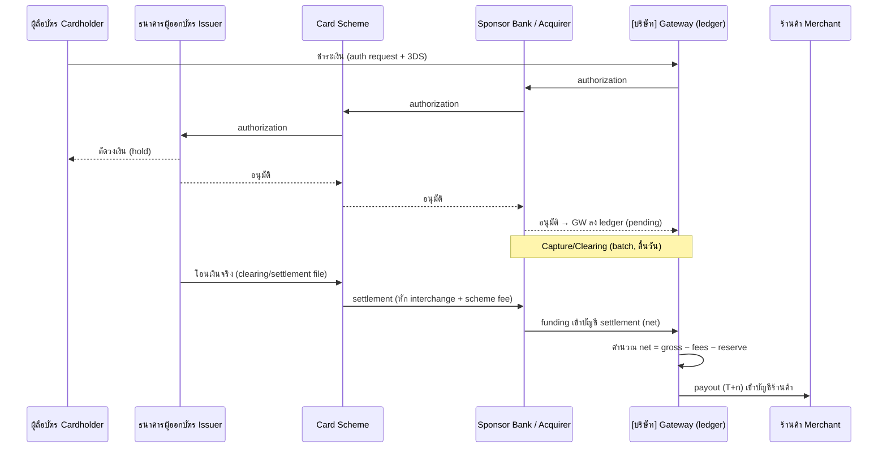
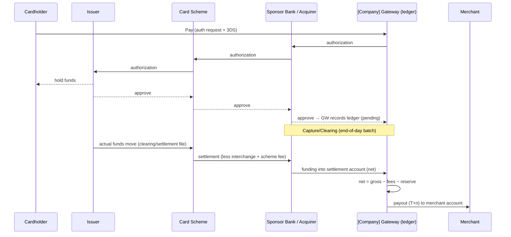

# ผังการไหลของธุรกรรมและเงิน (Fund-Flow & Settlement Model) (ไทย)

> เอกสารประกอบการยื่นขอใบอนุญาต **การให้บริการรับชำระเงินด้วยวิธีการทางอิเล็กทรอนิกส์ (Full Acquiring)**
> ภายใต้ พ.ร.บ. ระบบการชำระเงิน พ.ศ. 2560 ต่อธนาคารแห่งประเทศไทย (ธปท.) และเป็นเอกสารประกอบการประเมิน PCI-DSS v4.0 Level 1
>
> เอกสารเลขที่: `COMP-36` · เวอร์ชัน 1.0 · เจ้าของเอกสาร: Settlement & Reconciliation Lead / CFO (ร่วมกับ Head of Payment Engineering และ MLRO)
> เอกสารอ้างอิง: `COMPLIANCE-TH.md` (§2, §5, §6), `ARCHITECTURE.md` (§4–§6, §8), `ROADMAP.md` (Phase 3), `docs/compliance/27-webhook-settlement-spec.md`, `docs/compliance/28-refund-chargeback-policy.md`, `docs/compliance/34-system-architecture.md`, `docs/compliance/05-aml-kyc-cdd-policy.md`, `docs/compliance/02-financial-projections-capital.md`
>
> **หมายเหตุ:** เอกสารนี้ตอบข้อกำหนดของ ธปท. ตาม `COMPLIANCE-TH.md` §5 ("ผังการไหลของธุรกรรมและเงิน") ในฐานะเอกสารเชิงกำกับดูแล **แยกต่างหากจาก** เอกสารสถาปัตยกรรมระบบ (`COMP-34`, มุ่งที่ส่วนประกอบระบบและ data-in-transit) และเอกสารข้อกำหนดทางเทคนิค settlement (`COMP-27`, มุ่งที่ HMAC/retry/ledger) โดยเอกสารนี้มุ่งอธิบาย **การเคลื่อนย้ายของ "เงิน" และคู่สัญญาทางเศรษฐกิจ/กฎหมาย** ตลอดวงจรชีวิตธุรกรรม เอกสารนี้เป็นเอกสารเชิงนโยบายภายใน ไม่ใช่คำแนะนำทางกฎหมาย ต้องผ่านการทบทวนโดยที่ปรึกษากฎหมาย ที่ปรึกษาบัญชี/ภาษี และ QSA ก่อนยื่นจริง

---

> ### ⚠️ ข้อสมมติและสิ่งที่ยังต้องยืนยัน (Assumptions / TODO)
> รายการต่อไปนี้ยังขึ้นกับคู่สัญญา/ผู้ให้บริการภายนอกที่ยังไม่สรุป — **ห้ามถือเป็นข้อเท็จจริงจนกว่าจะยืนยัน**:
> - **[TODO — Sponsor Bank / Acquirer]** ยังไม่ลงนามธนาคารผู้รับเชื่อม (sponsoring bank) — **โครงสร้างบัญชี settlement (nostro/ledgered account), เจ้าของบัญชีตามกฎหมาย, รอบ funding (T+n), สกุลเงิน settlement, และแนวทาง BIN sponsorship** จะยืนยันได้หลังลงนามเท่านั้น ค่าที่ระบุเป็น **ค่าตั้งต้นเชิงออกแบบ (design default)**
> - **[TODO — Client Money / Safeguarding]** โครงสร้างการถือเงินร้านค้าระหว่างทาง (client funds) ต้องยืนยันแนวทางกับ ธปท. — จะใช้ **บัญชีแยก (segregated/trust account)** หรือให้ sponsor bank เป็นผู้ถือ (bank-held settlement) และเงื่อนไขการคุ้มครองเงินลูกค้า (safeguarding) ตามหลักเกณฑ์ ธปท.
> - **[TODO — Interchange / Scheme Fees]** อัตรา interchange, scheme fee, และ acquirer processing fee ที่แท้จริง จะทราบหลังลงนาม sponsor bank และผ่าน scheme certification (`COMP-24`)
> - **[TODO — Rolling Reserve]** อัตรากันสำรอง (rolling reserve %) และระยะเวลาถือ (hold period) ต่อระดับความเสี่ยงร้านค้า เป็นค่าตั้งต้น ต้องยืนยันกับ sponsor bank และคณะกรรมการความเสี่ยง
> - **[TODO — FX]** หากรองรับธุรกรรมข้ามสกุลเงิน (multi-currency / DCC) ผู้ให้บริการ FX, มาร์กอัป, และรอบ settlement สกุลต่างประเทศ ต้องยืนยัน
> - **[TODO — ทุนจดทะเบียน]** ทุนจดทะเบียนชำระแล้วเป้าหมาย **50 ล้านบาท** (Full Acquiring) — ต้องยืนยันจำนวนที่ชำระจริงและรักษาไว้ ≥ 75% ตลอดการดำเนินงาน (ดู `02-financial-projections-capital.md`)
> - **[TODO — ชื่อบริษัท/เลขบัญชี]** ชื่อ `[บริษัท / Company]`, เลขบัญชี settlement, และชื่อธนาคาร ต้องเติมค่าจริงก่อนยื่นและก่อนการประเมิน on-site

---

## 1. วัตถุประสงค์และขอบเขต

เอกสารนี้อธิบาย **เส้นทางการไหลของเงิน (flow of funds)** และ **การไหลของข้อมูลธุรกรรม (transaction flow)** ตั้งแต่ผู้ถือบัตรชำระเงิน จนถึงร้านค้าได้รับเงินสุทธิ (net payout) รวมถึงเส้นทางย้อนกลับ (refund/chargeback) โดยระบุ **คู่สัญญาแต่ละราย ผู้ถือเงินในแต่ละช่วง (custody) หน้าที่ตามกฎหมาย และการควบคุมด้าน AML/บัญชี/ความเสี่ยง** เพื่อให้ ธปท. เห็นภาพว่าเงินของผู้ถือบัตรและร้านค้าถูกจัดการอย่างปลอดภัย โปร่งใส และแยกจากเงินของบริษัทอย่างเหมาะสม

ขอบเขต: ธุรกรรมบัตรเครดิต/เดบิต (Visa/Mastercard) ในโหมด **Full Acquiring** ผ่าน sponsor bank และ card scheme ครอบคลุม authorization, capture/clearing, settlement, payout, refund, chargeback, rolling reserve และ FX (ถ้ามี)

---

## 2. คู่สัญญาและบทบาท (Parties & Roles)

| คู่สัญญา | บทบาท | ถือเงินหรือไม่ | หน้าที่/การควบคุมหลัก |
|----------|-------|----------------|------------------------|
| ผู้ถือบัตร (Cardholder) | ผู้ชำระเงินต้นทาง | — | ยินยอมชำระ, ผ่าน 3DS (`COMP-22`) |
| ธนาคารผู้ออกบัตร (Issuer) | อนุมัติ/หักเงินผู้ถือบัตร | ✔ (ต้นทาง) | authorization, ตัดวงเงิน, ออก dispute |
| Card Scheme (Visa/MC) | switching/clearing/settlement | ✔ (ผ่านทาง) | กำหนด interchange/scheme fee, ไฟล์ clearing |
| Sponsor Bank / Acquirer | รับเชื่อม BIN, ถือบัญชี settlement | ✔ (ปลายทางหลัก) | funding, safeguarding, รายงานตาม `COMP-30` **[TODO]** |
| **[บริษัท / Company]** (Gateway) | ประมวลผล, ledger, จ่าย payout | ✔/แล้วแต่โครงสร้าง **[TODO]** | ledger append-only, reconciliation, AML monitoring |
| ร้านค้า (Merchant) | ผู้รับเงินปลายทาง | ✔ (ปลายทาง) | KYC/CDD (`COMP-05`), สัญญา (`COMP-25`) |

> **จุดสำคัญด้านการถือเงิน (custody):** โครงสร้างที่นิยมและมีความเสี่ยงต่ำที่สุดคือให้ **sponsor bank เป็นผู้ถือเงิน settlement** (bank-held) และบริษัทเป็นเพียงผู้สั่งจ่าย (instruction) โดยไม่ commingle กับเงินดำเนินงานของบริษัท หากบริษัทถือเงินร้านค้าระหว่างทางเอง ต้องใช้ **บัญชีแยก (segregated/trust account)** และมาตรการ safeguarding ตามที่ ธปท. กำหนด **[TODO — ยืนยันโครงสร้าง]**

---

## 3. เส้นทางเงินขาไป (Forward Fund Flow — Purchase → Payout)



**ลำดับการหักเงิน (fee waterfall) ต่อธุรกรรม:**

```
เงินที่ผู้ถือบัตรจ่าย (gross)
  − interchange fee (ไป issuer, ผ่าน scheme)         [TODO อัตราจริง]
  − scheme fee (ไป Visa/MC)                          [TODO]
  − acquirer/sponsor processing fee                  [TODO]
  − ค่าธรรมเนียมบริการของบริษัท (MDR margin)
  − rolling reserve (กันสำรอง, คืนภายหลัง)            [TODO %]
  = เงินสุทธิจ่ายร้านค้า (net payout, T+n)
```

> รายละเอียด T+n, cut-off, และไฟล์ clearing (Visa TC33/VSS, Mastercard IPM/T112) อยู่ใน `COMP-27` §4; เอกสารนี้ระบุเฉพาะ **ทิศทางและการถือครองเงิน**

---

## 4. เส้นทางเงินขากลับ (Reverse Fund Flow — Refund & Chargeback)

| เหตุการณ์ | ทิศทางเงิน | ผู้ริเริ่ม | แหล่งเงินคืน | อ้างอิง |
|-----------|-----------|-----------|--------------|---------|
| Refund (ร้านค้าคืนเงิน) | GW/Merchant → Scheme → Issuer → Cardholder | ร้านค้า | หัก balance/next payout ของร้านค้า | `COMP-28` |
| Chargeback (ผู้ถือบัตรโต้แย้ง) | Issuer ← Scheme ← SB ← GW ← Merchant | Issuer | หัก balance ร้านค้า / rolling reserve | `COMP-28`, `COMP-29` |
| Representment (โต้แย้งกลับ) | คืนสู่ merchant หากชนะ | บริษัท/ร้านค้า | scheme คืนเมื่อชนะ dispute | `COMP-29` |

> **การคุ้มครองความเสี่ยงเครดิต:** หากร้านค้ามี balance/reserve ไม่พอชำระ chargeback/refund บริษัทมีความเสี่ยงต้องรับผิด (acquirer liability) จึงใช้ **rolling reserve + delayed payout ตามระดับความเสี่ยง** (ดู `COMP-08` การจัดระดับความเสี่ยง และ `COMP-28`) เพื่อจำกัด exposure

---

## 5. Rolling Reserve, Reserve Release และ FX

- **Rolling reserve:** กันเงิน `X%` ของยอดธุรกรรม ถือไว้ `N` วัน (ค่าตั้งต้นตามระดับความเสี่ยงร้านค้า) เพื่อรองรับ chargeback/refund ล่วงหน้า — **[TODO อัตราจริงต่อ risk tier]**
- **Reserve release:** ปล่อยคืนตามกำหนดเวลาแบบ rolling (เช่น ยอดที่กันวันนี้คืนในอีก N วัน) บันทึกเป็นรายการ ledger แยกประเภท
- **FX / Multi-currency:** หากธุรกรรมสกุลต่างประเทศ → แปลงที่จุด settlement ด้วยอัตราของ scheme/ผู้ให้บริการ FX + มาร์กอัปที่เปิดเผย, settlement สู่บริษัทอาจเป็นสกุล THB หรือสกุลต่างประเทศตามข้อตกลง sponsor bank **[TODO]**

---

## 6. การควบคุมด้าน AML และการกระทบยอด (AML Controls on Fund Flow & Reconciliation)

- **Transaction laundering / merchant-based ML:** เฝ้าระวังรูปแบบเงินไหลผิดปกติผ่านร้านค้า (เช่น ยอดพุ่งผิดปกติ, MCC ไม่ตรง, refund วนเงิน) ตาม `COMP-05` และ `COMP-07` (SAR/STR)
- **แยกเงินบริษัทออกจากเงินร้านค้า (no commingling):** ledger append-only double-entry แยกบัญชีย่อย (settlement payable, reserve, fee income, company operating) — เป็น source of truth ต่อการกระทบยอด (`COMP-27` §6)
- **Reconciliation 3 ทาง:** (ก) ยอดจาก scheme/sponsor bank settlement file ↔ (ข) ledger ภายใน ↔ (ค) payout จริงเข้าบัญชีร้านค้า — ต้องกระทบยอดครบทุกวันทำการ, ส่วนต่างต้องมี exception workflow
- **Audit trail:** ทุกการขยับเงินมี trace id, timestamp, actor ตามประกาศ ธปท. และ PCI-DSS Req 10 (`COMP-13`, `COMP-16`)
- **Reporting:** ยอด settlement/reserve/fee สรุปในรายงานเป็นงวดต่อ ธปท. (`COMP-35`) และ KRI (`COMP-32`)

---

## 7. สรุปการถือครองเงินตามช่วงเวลา (Custody Timeline)

| ช่วง | เงินอยู่ที่ | สถานะทางกฎหมาย |
|------|-----------|----------------|
| Authorization | ยังอยู่กับผู้ถือบัตร (hold) | ยังไม่โอน |
| หลัง clearing → funding | บัญชี settlement (sponsor bank ถือ) **[TODO]** | เงินร้านค้าที่รอจ่าย (payable) |
| ระหว่าง reserve hold | บัญชี reserve แยก | เงินร้านค้าที่กันสำรอง |
| หลัง payout (T+n) | บัญชีร้านค้า | เป็นของร้านค้า |
| ค่าธรรมเนียมบริษัท | บัญชีรายได้บริษัท | รายได้บริษัท |

> **หลักการ:** เงินร้านค้า/ผู้ถือบัตร **ไม่ปะปน** กับเงินดำเนินงานของบริษัท ตลอดทุกช่วง และมีการกระทบยอดทุกวันทำการ

---
---

# Transaction & Fund-Flow / Settlement Model (English)

> Supporting document for the application for a **Full Acquiring (Electronic Payment Acceptance) licence** under the Payment Systems Act B.E. 2560, submitted to the Bank of Thailand (BOT), and supporting evidence for the PCI-DSS v4.0 Level 1 assessment.
>
> Document no.: `COMP-36` · Version 1.0 · Owner: Settlement & Reconciliation Lead / CFO (with Head of Payment Engineering and MLRO).
> References: `COMPLIANCE-TH.md` (§2, §5, §6), `ARCHITECTURE.md` (§4–§6, §8), `ROADMAP.md` (Phase 3), `docs/compliance/27-webhook-settlement-spec.md`, `28-refund-chargeback-policy.md`, `34-system-architecture.md`, `05-aml-kyc-cdd-policy.md`, `02-financial-projections-capital.md`.
>
> **Note:** This document satisfies the BOT requirement in `COMPLIANCE-TH.md` §5 ("transaction and fund-flow diagram") as a **regulatory** artefact, **distinct from** the system-architecture document (`COMP-34`, focused on components and data-in-transit) and the settlement technical spec (`COMP-27`, focused on HMAC/retry/ledger). This document focuses on the **movement of money and the economic/legal parties** across the whole transaction lifecycle. This is an internal policy document, not legal advice; it must be reviewed by legal counsel, accounting/tax advisers and the QSA before actual submission.

---

> ### ⚠️ Assumptions / TODO
> The following depend on counterparties/providers not yet finalised — **do not treat as fact until confirmed**:
> - **[TODO — Sponsor Bank / Acquirer]** No signed sponsoring bank yet — **settlement account structure (nostro/ledgered), legal account owner, funding cycle (T+n), settlement currency, and BIN sponsorship** are confirmable only after signing. Values shown are **design defaults**.
> - **[TODO — Client Money / Safeguarding]** The structure for holding merchant funds in transit must be confirmed with BOT — whether a **segregated/trust account** is used or funds are **bank-held** by the sponsor bank, plus safeguarding conditions per BOT rules.
> - **[TODO — Interchange / Scheme Fees]** Actual interchange, scheme fees, and acquirer processing fees are known only after signing the sponsor bank and passing scheme certification (`COMP-24`).
> - **[TODO — Rolling Reserve]** Reserve rate (%) and hold period per merchant risk tier are defaults; confirm with sponsor bank and Risk Committee.
> - **[TODO — FX]** If cross-currency/DCC is supported, the FX provider, markup, and foreign-currency settlement cycle must be confirmed.
> - **[TODO — Paid-up capital]** Target paid-up capital **THB 50 million** (Full Acquiring) — confirm the amount actually paid and maintained ≥ 75% at all times (see `02-financial-projections-capital.md`).
> - **[TODO — Company name/account numbers]** `[บริษัท / Company]`, settlement account numbers, and bank name must be populated before submission and the on-site assessment.

---

## 1. Purpose & Scope

This document describes the **flow of funds** and **transaction flow** from the cardholder's payment through to the merchant receiving net payout, including reverse flows (refund/chargeback). It identifies **each party, who holds the funds at each stage (custody), legal duties, and AML/accounting/risk controls**, so that BOT can see that cardholder and merchant money is handled safely, transparently, and appropriately segregated from company funds.

Scope: credit/debit card transactions (Visa/Mastercard) in **Full Acquiring** mode via a sponsor bank and card scheme, covering authorization, capture/clearing, settlement, payout, refund, chargeback, rolling reserve, and FX (if any).

---

## 2. Parties & Roles

| Party | Role | Holds funds? | Key duties/controls |
|-------|------|--------------|---------------------|
| Cardholder | Originating payer | — | Consents to pay, passes 3DS (`COMP-22`) |
| Issuer | Approves/debits cardholder | ✔ (origin) | Authorization, credit hold, raises disputes |
| Card Scheme (Visa/MC) | Switching/clearing/settlement | ✔ (pass-through) | Sets interchange/scheme fees, clearing files |
| Sponsor Bank / Acquirer | BIN sponsorship, holds settlement account | ✔ (primary endpoint) | Funding, safeguarding, reporting per `COMP-30` **[TODO]** |
| **[บริษัท / Company]** (Gateway) | Processing, ledger, payout | ✔/structure-dependent **[TODO]** | Append-only ledger, reconciliation, AML monitoring |
| Merchant | Final payee | ✔ (endpoint) | KYC/CDD (`COMP-05`), agreement (`COMP-25`) |

> **Custody note:** The lowest-risk and preferred structure is for the **sponsor bank to be the settlement fund holder** (bank-held), with the company only issuing payout instructions and never commingling with operating cash. If the company itself holds merchant funds in transit, a **segregated/trust account** and BOT-mandated safeguarding measures apply **[TODO — confirm structure]**.

---

## 3. Forward Fund Flow (Purchase → Payout)



**Fee waterfall per transaction:**

```
Gross paid by cardholder
  − interchange fee (to issuer, via scheme)        [TODO actual rate]
  − scheme fee (to Visa/MC)                        [TODO]
  − acquirer/sponsor processing fee                [TODO]
  − company service fee (MDR margin)
  − rolling reserve (held, released later)         [TODO %]
  = net payout to merchant (T+n)
```

> T+n, cut-off, and clearing-file details (Visa TC33/VSS, Mastercard IPM/T112) are in `COMP-27` §4; this document specifies only **direction and custody of money**.

---

## 4. Reverse Fund Flow (Refund & Chargeback)

| Event | Money direction | Initiator | Source of funds | Ref |
|-------|-----------------|-----------|-----------------|-----|
| Refund | GW/Merchant → Scheme → Issuer → Cardholder | Merchant | Merchant balance / next payout | `COMP-28` |
| Chargeback | Issuer ← Scheme ← SB ← GW ← Merchant | Issuer | Merchant balance / rolling reserve | `COMP-28`, `COMP-29` |
| Representment | Back to merchant if won | Company/Merchant | Scheme returns on dispute win | `COMP-29` |

> **Credit-risk protection:** If a merchant's balance/reserve is insufficient to cover chargebacks/refunds, the company bears acquirer liability. Hence **rolling reserve + risk-based delayed payout** (see `COMP-08` risk tiers and `COMP-28`) limit exposure.

---

## 5. Rolling Reserve, Reserve Release & FX

- **Rolling reserve:** Hold `X%` of transaction volume for `N` days (defaults by merchant risk tier) to pre-fund chargebacks/refunds — **[TODO actual rate per risk tier]**.
- **Reserve release:** Released on a rolling schedule (e.g., today's held amount released after N days), recorded as separate ledger entries.
- **FX / Multi-currency:** For foreign-currency transactions, conversion occurs at settlement using scheme/FX-provider rates plus disclosed markup; settlement to the company may be in THB or foreign currency per sponsor-bank terms **[TODO]**.

---

## 6. AML Controls on Fund Flow & Reconciliation

- **Transaction laundering / merchant-based ML:** Monitor abnormal fund patterns through merchants (e.g., volume spikes, MCC mismatch, refund cycling) per `COMP-05` and `COMP-07` (SAR/STR).
- **No commingling of company vs merchant funds:** Append-only double-entry ledger with sub-accounts (settlement payable, reserve, fee income, company operating) as the reconciliation source of truth (`COMP-27` §6).
- **Three-way reconciliation:** (a) scheme/sponsor-bank settlement file ↔ (b) internal ledger ↔ (c) actual payout to merchant account — reconciled every business day; discrepancies enter an exception workflow.
- **Audit trail:** Every money movement carries trace id, timestamp, actor per BOT rules and PCI-DSS Req 10 (`COMP-13`, `COMP-16`).
- **Reporting:** Settlement/reserve/fee balances summarised in periodic BOT reports (`COMP-35`) and KRIs (`COMP-32`).

---

## 7. Custody Timeline

| Stage | Where money sits | Legal status |
|-------|------------------|--------------|
| Authorization | Still with cardholder (hold) | Not yet transferred |
| After clearing → funding | Settlement account (sponsor bank holds) **[TODO]** | Merchant payable |
| During reserve hold | Separate reserve account | Merchant reserve |
| After payout (T+n) | Merchant account | Merchant's own funds |
| Company fees | Company income account | Company revenue |

> **Principle:** Merchant/cardholder money is **never commingled** with the company's operating funds at any stage, and is reconciled every business day.
